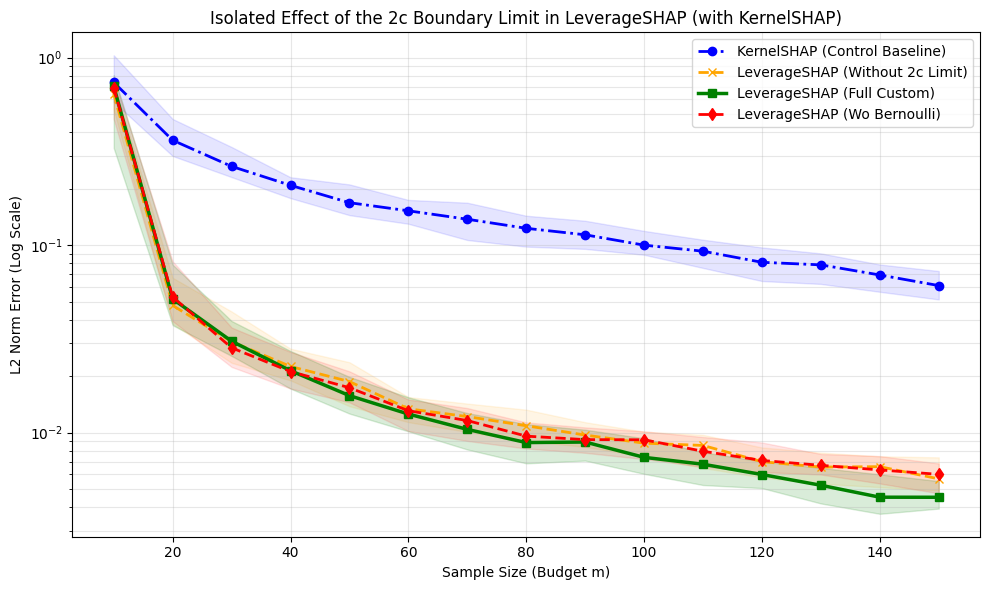
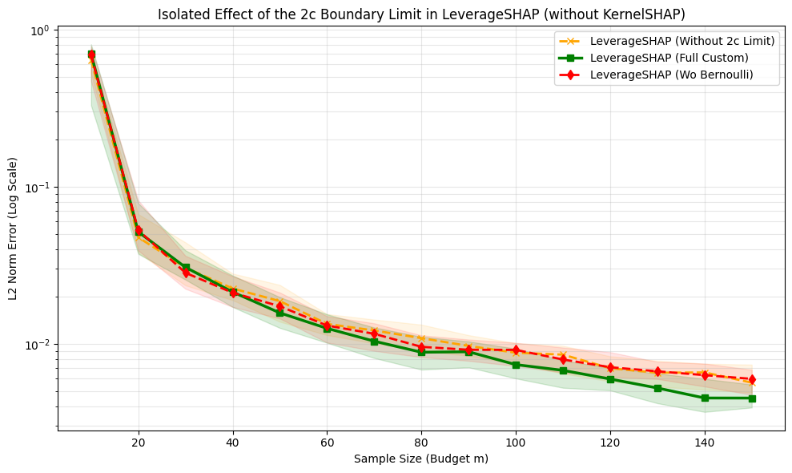

```python
# %%
# ruff: noqa: T201
"""Benchmark evaluating the isolated effect of the 2c threshold in LeverageSHAP.

The comparison includes:
1. KernelSHAP (Standard Control)
2. LeverageSHAP (Without 2c Limit) - Leverage score weights, but uniform budget allocation
3. LeverageSHAP (Full Custom) - Optimal 2c-based Bernoulli thresholding
"""

from __future__ import annotations

import math
import random as _py_random
import warnings
from typing import Any

import matplotlib.pyplot as plt
import numpy as np
import xgboost as xgb
from scipy.stats import wilcoxon
from sklearn.datasets import fetch_california_housing
from sklearn.model_selection import train_test_split

from shapiq import KernelSHAP
from shapiq.approximator.regression.leverageshap import LeverageSHAP
from shapiq.approximator.sampling import CoalitionSampler
from shapiq.interaction_values import InteractionValues

warnings.filterwarnings("ignore")
```


```python
# %%
# ── LeverageSHAP Variant without the 2c Threshold Limit ───────────────
class LeverageSHAPWithout2c(LeverageSHAP):
    """LeverageSHAP variant that bypasses the 2c oversampling and threshold boundaries.

    This class overrides the sampling method to demonstrate the impact of omitting
    the optimal boundary thresholding from the algorithm.
    """

    def _sample(self, budget: int) -> tuple[np.ndarray, np.ndarray]:
        if budget < 2:
            msg = "Budget must be at least 2 to evaluate baseline and grand coalition."
            raise ValueError(msg)

        n = self.n
        m = min(budget, 2**n)

        z_empty = np.zeros(n, dtype=bool)
        z_grand = np.ones(n, dtype=bool)

        # -----------------------------------------------------------------
        # - OMITTED: Finding the optimal oversampling parameter `c` via binary search
        # - c = self._find_c(n, m)
        # -----------------------------------------------------------------
        # + ADDED INSTEAD:
        # + Without the parameter `c`, a flat allocation is applied to distribute
        # + the total pair budget (m - 2) // 2 evenly across all possible size layers s.
        # -----------------------------------------------------------------
        n_pairs_target = (m - 2) // 2
        sizes_to_sample = list(range(1, n // 2 + 1))
        num_sizes = len(sizes_to_sample)

        pairs_per_size = n_pairs_target // num_sizes if num_sizes > 0 else 0
        remainder = n_pairs_target % num_sizes if num_sizes > 0 else 0

        z_list: list[np.ndarray] = []
        sizes_list: list[int] = []

        py_seed = int(self._rng.integers(0, 2**32))
        py_rng = _py_random.Random(py_seed)

        for idx_size, s in enumerate(sizes_to_sample):
            is_middle = (n % 2 == 0) and (s == n // 2)
            full_count = math.comb(n, s)
            pool_size = math.comb(n - 1, s - 1) if is_middle else full_count

            # Determine target pair budget for this size layer
            m_s_target = pairs_per_size + (1 if idx_size < remainder else 0)
            m_s = min(m_s_target, pool_size)

            # -----------------------------------------------------------------
            # - OMITTED: Bernoulli sampling using 2c-based probability and thresholding
            # - Z_pairs, sizes = self._bernoulli_sample(n, c)
            # - (Which caps smaller sizes at prob = 1.0 and samples larger sizes with prob = 2c / full_count)
            # -----------------------------------------------------------------
            # + ADDED INSTEAD:
            # + We bypass the binomial probabilistic assignment and sample exactly `m_s`
            # + unique coalitions directly without threshold limits.
            # -----------------------------------------------------------------
            indices = self._sample_without_replacement(pool_size, m_s, py_rng)

            for idx in indices:
                if is_middle:
                    z_partial = self._combo(n - 1, s - 1, idx)
                    z = np.zeros(n, dtype=bool)
                    z[: n - 1] = z_partial
                    z[n - 1] = True
                else:
                    z = self._combo(n, s, idx)
                z_bar = ~z
                z_list.append(z)
                z_list.append(z_bar)
                sizes_list.append(s)
                sizes_list.append(n - s)

        if len(z_list) > 0:
            Z_pairs = np.array(z_list)
            sizes = np.array(sizes_list)
            weights_pairs = np.empty(Z_pairs.shape[0], dtype=float)
            fact_n = math.factorial(n)

            for i, s in enumerate(sizes):
                w_s = (math.factorial(s - 1) * math.factorial(n - s - 1)) / fact_n

                # -----------------------------------------------------------------
                # - OMITTED: Importance sampling reweighting using 2c and leverage score
                # - l_z = 1.0 / math.comb(n, s)
                # - p = min(1.0, 2.0 * c * l_z)
                # - weights_pairs[i] = w_s / p
                # -----------------------------------------------------------------
                # + ADDED INSTEAD:
                # + Without `c`, we use the actual sampling probability of drawing
                # + a specific coalition in this size layer: p = m_s / pool_size.
                # + This maintains the weight-cancellation property of the leverage scores
                # + but does not use the optimal planning constant `c`.
                # -----------------------------------------------------------------
                s_paired = min(s, n - s)
                is_middle_s = (n % 2 == 0) and (s_paired == n // 2)
                pool_s = math.comb(n - 1, s_paired - 1) if is_middle_s else math.comb(n, s_paired)

                idx_in_loop = sizes_to_sample.index(s_paired)
                m_s_drawn = pairs_per_size + (1 if idx_in_loop < remainder else 0)
                m_s_drawn = min(m_s_drawn, pool_s)

                p_s_actual = m_s_drawn / pool_s if pool_s > 0 else 1.0
                if p_s_actual <= 0:
                    p_s_actual = 1.0

                weights_pairs[i] = w_s / p_s_actual

            Z = np.vstack([z_empty[None, :], z_grand[None, :], Z_pairs])
            weights = np.concatenate([[0.0, 0.0], weights_pairs])
        else:
            Z = np.vstack([z_empty[None, :], z_grand[None, :]])
            weights = np.array([0.0, 0.0])

        return Z, weights


class LeverageSHAPWoBernoulli(LeverageSHAP):
    """LeverageSHAP using the standard CoalitionSampler instead of Algorithm 2."""

    def __init__(
        self, n: int, *, pairing_trick: bool = True, random_state: int | None = None, **kwargs: Any
    ) -> None:
        """Initialize the class override for benchmarking."""
        self._explicit_seed = random_state
        super().__init__(n=n, pairing_trick=pairing_trick, random_state=random_state, **kwargs)

    def _sample(self, budget: int) -> tuple[np.ndarray, np.ndarray]:
        sampler = CoalitionSampler(
            n_players=self.n,
            sampling_weights=np.ones(self.n + 1),
            pairing_trick=True,
            random_state=self._explicit_seed,
        )

        sampler.sample(budget)
        Z = sampler.coalitions_matrix
        is_weights = sampler.sampling_adjustment_weights

        weights = np.zeros_like(is_weights)
        fact_n = math.factorial(self.n)
        sizes = Z.sum(axis=1)

        for i, s in enumerate(sizes):
            if 0 < s < self.n:
                w_s = (math.factorial(s - 1) * math.factorial(self.n - s - 1)) / fact_n
                weights[i] = is_weights[i] * w_s

        return Z, weights
```


```python
# %%
# ── Metrics & Extraction Helpers ──────────────────────────────────────
def norm_l2(exact: np.ndarray, approx: np.ndarray) -> float:
    """Normalized ℓ₂ error: ‖exact − approx‖₂ / ‖exact‖₂."""
    denom = np.linalg.norm(exact)
    return 0.0 if denom < 1e-12 else float(np.linalg.norm(exact - approx) / denom)


def extract_sv(iv: InteractionValues, n: int) -> np.ndarray:
    """Extract Shapley vector of length n from an IV mapping."""
    return np.array([iv[(i,)] for i in range(n)])
```


```python
# %%
# ── Setup California Dataset (n=8) ────────────────────────────────────
X, y = fetch_california_housing(return_X_y=True)
n_players = 8

X_train, X_test, y_train, _ = train_test_split(X[:, :n_players], y, test_size=0.2, random_state=42)

model = xgb.XGBRegressor(n_estimators=100, max_depth=4, random_state=42, verbosity=0)
model.fit(X_train, y_train)

bg_mean = X_train.mean(axis=0)
x_instance = X_test[0]


def game(Z: np.ndarray) -> np.ndarray:
    """Mean-substitution game."""
    X_masked = np.where(Z, x_instance[np.newaxis, :], bg_mean[np.newaxis, :])
    return model.predict(X_masked)
```


```python
# %%
# ── Run the Benchmark ─────────────────────────────────────────────────
n_runs = 50
budgets = np.linspace(10, 150, 15, dtype=int).tolist()

errs_ks = np.zeros((n_runs, len(budgets)))
errs_lev_no_2c = np.zeros((n_runs, len(budgets)))
errs_lev_full = np.zeros((n_runs, len(budgets)))
errs_lev_wo_bernoulli = np.zeros((n_runs, len(budgets)))

# Ground Truth Exact values
ks_exact = KernelSHAP(n=n_players, random_state=0)
iv_exact = ks_exact.approximate(2**n_players, game)
exact_sv = extract_sv(iv_exact, n_players)

print("Starting benchmark calculation...")
for i, budget in enumerate(budgets):
    for seed in range(n_runs):
        # 1. KernelSHAP (Control)
        ks = KernelSHAP(n=n_players, random_state=seed)
        errs_ks[seed, i] = norm_l2(exact_sv, extract_sv(ks.approximate(budget, game), n_players))

        # 2. LeverageSHAP without the 2c limit
        lev_no_2c = LeverageSHAPWithout2c(n=n_players, random_state=seed)
        errs_lev_no_2c[seed, i] = norm_l2(
            exact_sv, extract_sv(lev_no_2c.approximate(budget, game), n_players)
        )

        # 3. Full Custom LeverageSHAP (with 2c)
        lev_full = LeverageSHAP(n=n_players, random_state=seed)
        errs_lev_full[seed, i] = norm_l2(
            exact_sv, extract_sv(lev_full.approximate(budget, game), n_players)
        )

        # 4. LeverageSHAPWoBernoulli
        lev_wo_bernoulli = LeverageSHAPWoBernoulli(n=n_players, random_state=seed)
        errs_lev_wo_bernoulli[seed, i] = norm_l2(
            exact_sv, extract_sv(lev_wo_bernoulli.approximate(budget, game), n_players)
        )
```

    Starting benchmark calculation...


```python
# %%
# ── Plotting Helper ───────────────────────────────────────────────────
def plot_results(plot_kernel: bool = False) -> None:
    plt.figure(figsize=(10, 6))

    if plot_kernel:
        plt.semilogy(
            budgets,
            np.median(errs_ks, axis=0),
            "o-.",
            label="KernelSHAP (Control Baseline)",
            color="blue",
            linewidth=2,
        )

    plt.semilogy(
        budgets,
        np.median(errs_lev_no_2c, axis=0),
        "x--",
        label="LeverageSHAP (Without 2c Limit)",
        color="orange",
        linewidth=2,
    )

    plt.semilogy(
        budgets,
        np.median(errs_lev_full, axis=0),
        "s-",
        label="LeverageSHAP (Full Custom)",
        color="green",
        linewidth=2.5,
    )

    plt.semilogy(
        budgets,
        np.median(errs_lev_wo_bernoulli, axis=0),
        "d--",
        label="LeverageSHAP (Wo Bernoulli)",
        color="red",
        linewidth=2,
    )

    # Fill Quantiles
    if plot_kernel:
        plt.fill_between(
            budgets,
            np.percentile(errs_ks, 25, axis=0),
            np.percentile(errs_ks, 75, axis=0),
            alpha=0.1,
            color="blue",
        )

    plt.fill_between(
        budgets,
        np.percentile(errs_lev_no_2c, 25, axis=0),
        np.percentile(errs_lev_no_2c, 75, axis=0),
        alpha=0.1,
        color="orange",
    )
    plt.fill_between(
        budgets,
        np.percentile(errs_lev_full, 25, axis=0),
        np.percentile(errs_lev_full, 75, axis=0),
        alpha=0.15,
        color="green",
    )
    plt.fill_between(
        budgets,
        np.percentile(errs_lev_wo_bernoulli, 25, axis=0),
        np.percentile(errs_lev_wo_bernoulli, 75, axis=0),
        alpha=0.1,
        color="red",
    )

    plt.xlabel("Sample Size (Budget m)")
    plt.ylabel("L2 Norm Error (Log Scale)")
    plt.title(
        "Isolated Effect of the 2c Boundary Limit in LeverageSHAP"
        + (" (with KernelSHAP)" if plot_kernel else " (without KernelSHAP)")
    )
    plt.legend()
    plt.grid(True, which="both", alpha=0.3)
    plt.tight_layout()
    plt.show()


# Run both variants
plot_results(plot_kernel=True)
plot_results(plot_kernel=False)
```








```python
import pandas as pd

# Build per-instance table (each run x budget pair)
n_runs_, n_budgets_ = errs_lev_no_2c.shape

table = pd.DataFrame(
    {
        "run": np.repeat(np.arange(n_runs_), n_budgets_),
        "budget": np.tile(budgets, n_runs_),
        "err_ks": errs_ks.ravel(),
        "err_lev_no_2c": errs_lev_no_2c.ravel(),
        "err_lev_full": errs_lev_full.ravel(),
        "err_lev_wo_bernoulli": errs_lev_wo_bernoulli.ravel(),
    }
)

# Wins (lower error is better)
table["lev_full_wins_vs_no_2c"] = table["err_lev_full"] < table["err_lev_no_2c"]
table["lev_full_wins_vs_wo_bernoulli"] = table["err_lev_full"] < table["err_lev_wo_bernoulli"]
table["no_2c_wins_vs_wo_bernoulli"] = table["err_lev_no_2c"] < table["err_lev_wo_bernoulli"]

# Win margins (positive => left model is better)
table["margin_full_vs_no2c"] = table["err_lev_no_2c"] - table["err_lev_full"]
table["margin_full_vs_wo_bern"] = table["err_lev_wo_bernoulli"] - table["err_lev_full"]
table["margin_no2c_vs_wo_bern"] = table["err_lev_wo_bernoulli"] - table["err_lev_no_2c"]

print("=== Per-instance table (all run x budget entries) ===")
print(table.to_string(index=False))


# ── Budget-wise win rates AND paired significance ─────────────────────────────
# The 750 rows are NOT independent: the same 50 seeds recur across all 15 budgets and
# are shared by every method. Treating them as 750 independent Bernoulli trials would
# overstate precision. We therefore report a paired Wilcoxon signed-rank test *per
# budget* on the per-seed error differences (the 50 seeds are the paired units within a
# budget). "Sig." = p < 0.05 AND lower median error for lev_full.
def paired_wilcoxon(err_a: np.ndarray, err_b: np.ndarray) -> tuple[float, float]:
    """Return (median difference b - a, p-value) for a paired Wilcoxon test per column-slice."""
    diff = err_b - err_a  # positive => a (lev_full) is better
    if np.allclose(diff, 0.0):
        return 0.0, 1.0
    try:
        _, p = wilcoxon(diff)
    except ValueError:
        return float(np.median(diff)), 1.0
    return float(np.median(diff)), float(p)


sig_rows = []
for i, budget in enumerate(budgets):
    med_fn, p_fn = paired_wilcoxon(errs_lev_full[:, i], errs_lev_no_2c[:, i])
    med_fb, p_fb = paired_wilcoxon(errs_lev_full[:, i], errs_lev_wo_bernoulli[:, i])
    sig_rows.append(
        {
            "budget": budget,
            "p_full_vs_no2c": round(p_fn, 4),
            "full_better_no2c": bool(p_fn < 0.05 and med_fn > 0),
            "p_full_vs_wo_bern": round(p_fb, 4),
            "full_better_wo_bern": bool(p_fb < 0.05 and med_fb > 0),
        }
    )
sig_by_budget = pd.DataFrame(sig_rows)

# Budget-wise win summary (raw win counts, kept for context; see significance table above)
summary_by_budget = table.groupby("budget", as_index=False).agg(
    instances=("budget", "size"),
    lev_full_win_count=("lev_full_wins_vs_no_2c", "sum"),
    lev_full_vs_wo_bern_win_count=("lev_full_wins_vs_wo_bernoulli", "sum"),
    no_2c_win_count=("no_2c_wins_vs_wo_bernoulli", "sum"),
    median_err_lev_full=("err_lev_full", "median"),
    median_err_lev_no_2c=("err_lev_no_2c", "median"),
    median_err_lev_wo_bernoulli=("err_lev_wo_bernoulli", "median"),
)
summary_by_budget = summary_by_budget.merge(sig_by_budget, on="budget")

print("\n=== Paired Wilcoxon significance by budget (50 shared seeds per budget) ===")
print(sig_by_budget.to_string(index=False))

n_sig_full_no2c = int(sig_by_budget["full_better_no2c"].sum())
n_sig_full_wo_bern = int(sig_by_budget["full_better_wo_bern"].sum())
print(
    f"\nlev_full significantly better than lev_no_2c at {n_sig_full_no2c}/{len(budgets)} budgets; "
    f"than lev_wo_bernoulli at {n_sig_full_wo_bern}/{len(budgets)} budgets (p < 0.05, paired)."
)

# Overall paired test: pool the per-seed differences across budgets but respect pairing
# (each (seed, budget) difference is one paired observation).
overall_rows = []
for name, err_left, err_right in [
    ("lev_full vs lev_no_2c", errs_lev_full, errs_lev_no_2c),
    ("lev_full vs lev_wo_bernoulli", errs_lev_full, errs_lev_wo_bernoulli),
    ("lev_no_2c vs lev_wo_bernoulli", errs_lev_no_2c, errs_lev_wo_bernoulli),
]:
    diff = (err_right - err_left).ravel()  # positive => left is better
    try:
        _, p = wilcoxon(diff)
    except ValueError:
        p = 1.0
    overall_rows.append(
        {
            "comparison": name,
            "median_margin": round(float(np.median(diff)), 5),
            "p_value": f"{p:.2e}",
            "left_better": bool(p < 0.05 and np.median(diff) > 0),
        }
    )
overall = pd.DataFrame(overall_rows)

print("\n=== Overall paired Wilcoxon summary (positive margin => left model better) ===")
print(overall.to_string(index=False))
```

    === Per-instance table (all run x budget entries) ===
     run  budget       err_ks  err_lev_no_2c  err_lev_full  err_lev_wo_bernoulli  lev_full_wins_vs_no_2c  lev_full_wins_vs_wo_bernoulli  no_2c_wins_vs_wo_bernoulli  margin_full_vs_no2c  margin_full_vs_wo_bern  margin_no2c_vs_wo_bern
       0      10 9.387193e-01       0.701070      0.847305              0.791678                   False                          False                        True        -1.462345e-01               -0.055626            9.060822e-02
       0      20 4.137244e-01       0.038156      0.813323              0.093654                   False                          False                        True        -7.751674e-01               -0.719669            5.549824e-02
       0      30 1.849863e-01       0.045829      0.039031              0.041928                    True                           True                       False         6.798088e-03                0.002897           -3.900779e-03
       0      40 1.722260e-01       0.022148      0.021287              0.016682                    True                          False                       False         8.608494e-04               -0.004605           -5.465499e-03
       0      50 1.362410e-01       0.019493      0.023753              0.015707                   False                          False                       False        -4.259937e-03               -0.008046           -3.785949e-03
       0      60 9.743068e-02       0.008141      0.020842              0.009998                   False                          False                        True        -1.270089e-02               -0.010844            1.857035e-03
       0      70 9.424941e-02       0.009165      0.014011              0.010255                   False                          False                        True        -4.845806e-03               -0.003757            1.089061e-03
       0      80 1.122590e-01       0.009964      0.015470              0.006349                   False                          False                       False        -5.506548e-03               -0.009121           -3.614298e-03
       0      90 1.354771e-01       0.007621      0.009386              0.004595                   False                          False                       False        -1.765391e-03               -0.004791           -3.025658e-03
       0     100 1.241587e-01       0.008361      0.008458              0.006183                   False                          False                       False        -9.650064e-05               -0.002275           -2.178137e-03
       0     110 7.346209e-02       0.009434      0.003906              0.005880                    True                           True                       False         5.528781e-03                0.001974           -3.554561e-03
       0     120 4.727594e-02       0.006380      0.006676              0.005163                   False                          False                       False        -2.965313e-04               -0.001513           -1.216942e-03
       0     130 5.111932e-02       0.005375      0.005910              0.005721                   False                          False                        True        -5.350201e-04               -0.000189            3.458240e-04
       0     140 9.868267e-02       0.007005      0.007409              0.005464                   False                          False                       False        -4.039045e-04               -0.001945           -1.540687e-03
       0     150 1.183154e-01       0.003623      0.006452              0.004062                   False                          False                        True        -2.828774e-03               -0.002389            4.394453e-04
       1      10 5.375910e-01       0.067278      0.055016              0.712611                    True                           True                        True         1.226199e-02                0.657595            6.453329e-01
       1      20 5.724136e-01       0.066100      0.050580              0.045869                    True                          False                       False         1.552087e-02               -0.004711           -2.023182e-02
       1      30 4.131897e-01       0.025724      0.018017              0.018535                    True                           True                       False         7.706650e-03                0.000518           -7.188899e-03
       1      40 1.864106e-01       0.025776      0.028642              0.015505                   False                          False                       False        -2.866296e-03               -0.013137           -1.027116e-02
       1      50 1.456904e-01       0.019706      0.029742              0.017214                   False                          False                       False        -1.003551e-02               -0.012528           -2.492043e-03
       1      60 1.279519e-01       0.012112      0.012419              0.014952                   False                           True                        True        -3.067194e-04                0.002533            2.839606e-03
       1      70 1.166629e-01       0.009943      0.008037              0.008770                    True                           True                       False         1.905474e-03                0.000733           -1.172534e-03
       1      80 7.841726e-02       0.010822      0.007634              0.008175                    True                           True                       False         3.187862e-03                0.000541           -2.647133e-03
       1      90 6.871282e-02       0.011336      0.009732              0.006670                    True                          False                       False         1.604414e-03               -0.003061           -4.665879e-03
       1     100 8.966786e-02       0.010448      0.010296              0.008280                    True                          False                       False         1.525574e-04               -0.002016           -2.168788e-03
       1     110 9.009210e-02       0.009056      0.006537              0.009363                    True                           True                        True         2.519066e-03                0.002826            3.069455e-04
       1     120 6.598653e-02       0.005812      0.002700              0.006604                    True                           True                        True         3.111907e-03                0.003904            7.917517e-04
       1     130 5.529107e-02       0.003242      0.003400              0.006626                   False                           True                        True        -1.582725e-04                0.003226            3.384252e-03
       1     140 7.880565e-02       0.002201      0.003719              0.006305                   False                           True                        True        -1.517572e-03                0.002586            4.103483e-03
       1     150 5.842021e-02       0.004045      0.004424              0.006235                   False                           True                        True        -3.794914e-04                0.001811            2.190332e-03
       2      10 5.265511e-01       0.627242      0.736191              0.657394                   False                          False                        True        -1.089487e-01               -0.078796            3.015221e-02
       2      20 4.944379e-01       0.055431      0.043990              0.055431                    True                           True                        True         1.144049e-02                0.011441            1.335089e-07
       2      30 2.510270e-01       0.098008      0.038439              0.049166                    True                           True                       False         5.956823e-02                0.010727           -4.884138e-02
       2      40 3.189226e-01       0.026298      0.027368              0.040663                   False                           True                        True        -1.070172e-03                0.013295            1.436504e-02
       2      50 2.142400e-01       0.013215      0.008040              0.010120                    True                           True                       False         5.175209e-03                0.002080           -3.095137e-03
       2      60 1.537664e-01       0.009012      0.004566              0.018828                    True                           True                        True         4.445289e-03                0.014261            9.816138e-03
       2      70 1.567920e-01       0.009476      0.008649              0.019550                    True                           True                        True         8.261552e-04                0.010900            1.007401e-02
       2      80 1.186102e-01       0.004726      0.006655              0.008698                   False                           True                        True        -1.929292e-03                0.002043            3.972166e-03
       2      90 1.260823e-01       0.004840      0.006085              0.009219                   False                           True                        True        -1.244668e-03                0.003135            4.379203e-03
       2     100 9.018854e-02       0.002538      0.006385              0.009309                   False                           True                        True        -3.847308e-03                0.002924            6.771515e-03
       2     110 1.001026e-01       0.008745      0.005472              0.006645                    True                           True                       False         3.272985e-03                0.001173           -2.100282e-03
       2     120 9.311918e-02       0.008085      0.008472              0.006347                   False                          False                       False        -3.873451e-04               -0.002125           -1.738057e-03
       2     130 8.032533e-02       0.007700      0.005528              0.006010                    True                           True                       False         2.171345e-03                0.000482           -1.689788e-03
       2     140 4.700572e-02       0.008339      0.006681              0.005213                    True                          False                       False         1.658673e-03               -0.001468           -3.126589e-03
       2     150 5.327451e-02       0.005086      0.006637              0.005007                   False                          False                       False        -1.551114e-03               -0.001631           -7.966925e-05
       3      10 2.986944e-01       0.700937      0.709115              0.075292                   False                          False                       False        -8.177329e-03               -0.633822           -6.256449e-01
       3      20 3.902203e-01       0.657334      0.053795              0.070737                    True                           True                       False         6.035395e-01                0.016942           -5.865971e-01
       3      30 2.558112e-01       0.024265      0.035444              0.029456                   False                          False                        True        -1.117944e-02               -0.005988            5.191246e-03
       3      40 2.021357e-01       0.017701      0.020057              0.020297                   False                           True                        True        -2.356373e-03                0.000240            2.596264e-03
       3      50 2.182825e-01       0.014895      0.020605              0.011715                   False                          False                       False        -5.709994e-03               -0.008891           -3.180888e-03
       3      60 1.785874e-01       0.012352      0.009638              0.007480                    True                          False                       False         2.714378e-03               -0.002157           -4.871870e-03
       3      70 1.445238e-01       0.012932      0.006628              0.008575                    True                           True                       False         6.304188e-03                0.001947           -4.357022e-03
       3      80 1.325928e-01       0.011253      0.008601              0.010358                    True                           True                       False         2.651761e-03                0.001757           -8.951169e-04
       3      90 1.465727e-01       0.006882      0.006685              0.007765                    True                           True                        True         1.969777e-04                0.001080            8.834937e-04
       3     100 1.237035e-01       0.007650      0.007766              0.009473                   False                           True                        True        -1.163168e-04                0.001706            1.822671e-03
       3     110 1.125544e-01       0.005255      0.008528              0.007899                   False                          False                        True        -3.272868e-03               -0.000629            2.644153e-03
       3     120 6.596121e-02       0.006082      0.005550              0.007384                    True                           True                        True         5.324740e-04                0.001835            1.302352e-03
       3     130 6.720299e-02       0.005037      0.004111              0.006835                    True                           True                        True         9.265017e-04                0.002724            1.797171e-03
       3     140 7.450693e-02       0.006715      0.006014              0.005680                    True                          False                       False         7.013261e-04               -0.000334           -1.035064e-03
       3     150 6.522842e-02       0.009296      0.004543              0.003265                    True                          False                       False         4.752930e-03               -0.001278           -6.030582e-03
       4      10 6.128375e-01       0.029243      0.425558              0.788840                   False                           True                        True        -3.963143e-01                0.363282            7.595965e-01
       4      20 7.454540e-01       0.048157      0.011075              0.067764                    True                           True                        True         3.708266e-02                0.056690            1.960690e-02
       4      30 3.412974e-01       0.039049      0.026238              0.033336                    True                           True                       False         1.281096e-02                0.007098           -5.712805e-03
       4      40 2.140863e-01       0.021344      0.024339              0.030961                   False                           True                        True        -2.994795e-03                0.006622            9.616717e-03
       4      50 1.610155e-01       0.021044      0.018017              0.010608                    True                          False                       False         3.026723e-03               -0.007409           -1.043566e-02
       4      60 1.678327e-01       0.010362      0.008650              0.012602                    True                           True                        True         1.712744e-03                0.003952            2.239522e-03
       4      70 1.419620e-01       0.009155      0.011251              0.014617                   False                           True                        True        -2.096181e-03                0.003366            5.461920e-03
       4      80 1.518022e-01       0.011462      0.010290              0.016220                    True                           True                        True         1.171644e-03                0.005930            4.758071e-03
       4      90 1.438736e-01       0.013869      0.009481              0.014771                    True                           True                        True         4.388191e-03                0.005289            9.012930e-04
       4     100 1.134666e-01       0.009935      0.007840              0.008615                    True                           True                       False         2.094631e-03                0.000774           -1.320236e-03
       4     110 1.040068e-01       0.013745      0.004748              0.008105                    True                           True                       False         8.996873e-03                0.003357           -5.639670e-03
       4     120 8.192688e-02       0.008689      0.004786              0.006097                    True                           True                       False         3.903156e-03                0.001311           -2.591889e-03
       4     130 9.389321e-02       0.010571      0.005217              0.006681                    True                           True                       False         5.353889e-03                0.001464           -3.889664e-03
       4     140 4.544251e-02       0.009376      0.003444              0.005343                    True                           True                       False         5.931820e-03                0.001898           -4.033790e-03
       4     150 3.681882e-02       0.006639      0.003390              0.005620                    True                           True                       False         3.249420e-03                0.002230           -1.019445e-03
       5      10 7.243675e-01       0.553411      0.864288              0.788894                   False                          False                        True        -3.108768e-01               -0.075394            2.354824e-01
       5      20 2.998840e-01       0.043677      0.059310              0.018113                   False                          False                       False        -1.563314e-02               -0.041197           -2.556387e-02
       5      30 2.419078e-01       0.028352      0.042219              0.021004                   False                          False                       False        -1.386778e-02               -0.021216           -7.347870e-03
       5      40 1.338150e-01       0.021619      0.026061              0.018989                   False                          False                       False        -4.442077e-03               -0.007072           -2.630388e-03
       5      50 1.288881e-01       0.026912      0.015844              0.019780                    True                           True                       False         1.106883e-02                0.003936           -7.132641e-03
       5      60 1.178947e-01       0.011379      0.013472              0.006325                   False                          False                       False        -2.092785e-03               -0.007147           -5.053859e-03
       5      70 1.072224e-01       0.013221      0.014048              0.008327                   False                          False                       False        -8.271711e-04               -0.005721           -4.893980e-03
       5      80 5.004836e-02       0.009861      0.011314              0.006397                   False                          False                       False        -1.452737e-03               -0.004916           -3.463546e-03
       5      90 5.434681e-02       0.009221      0.007079              0.007673                    True                           True                       False         2.142336e-03                0.000594           -1.548340e-03
       5     100 4.447130e-02       0.007371      0.010344              0.007508                   False                          False                        True        -2.972975e-03               -0.002836            1.372085e-04
       5     110 5.656634e-02       0.009736      0.007947              0.006477                    True                          False                       False         1.788617e-03               -0.001470           -3.258460e-03
       5     120 5.776641e-02       0.008782      0.008762              0.005527                    True                          False                       False         1.919127e-05               -0.003235           -3.254086e-03
       5     130 6.123240e-02       0.007603      0.007039              0.005858                    True                          False                       False         5.635330e-04               -0.001181           -1.744523e-03
       5     140 8.253375e-02       0.009043      0.003007              0.007692                    True                           True                       False         6.035249e-03                0.004685           -1.350537e-03
       5     150 7.319834e-02       0.006651      0.005362              0.006803                    True                           True                        True         1.288623e-03                0.001441            1.522875e-04
       6      10 8.051533e-01       0.532609      0.490376              0.711777                    True                           True                        True         4.223314e-02                0.221400            1.791673e-01
       6      20 3.545966e-01       0.050538      0.037118              0.478545                    True                           True                        True         1.342052e-02                0.441427            4.280069e-01
       6      30 2.927984e-01       0.026291      0.028245              0.042151                   False                           True                        True        -1.953512e-03                0.013906            1.585962e-02
       6      40 1.858746e-01       0.027397      0.016981              0.034140                    True                           True                        True         1.041635e-02                0.017159            6.742292e-03
       6      50 1.557089e-01       0.014702      0.012259              0.011145                    True                          False                       False         2.443372e-03               -0.001114           -3.557205e-03
       6      60 1.603375e-01       0.013944      0.012933              0.007085                    True                          False                       False         1.010815e-03               -0.005848           -6.858608e-03
       6      70 1.363430e-01       0.012921      0.010342              0.007837                    True                          False                       False         2.579545e-03               -0.002504           -5.083713e-03
       6      80 1.267641e-01       0.010229      0.010587              0.007113                   False                          False                       False        -3.576351e-04               -0.003474           -3.115924e-03
       6      90 1.196828e-01       0.006987      0.009333              0.006033                   False                          False                       False        -2.346117e-03               -0.003301           -9.544262e-04
       6     100 1.071650e-01       0.005083      0.007224              0.005057                   False                          False                       False        -2.140498e-03               -0.002167           -2.607357e-05
       6     110 1.016847e-01       0.007881      0.005041              0.003890                    True                          False                       False         2.840081e-03               -0.001150           -3.990508e-03
       6     120 9.028437e-02       0.007284      0.004994              0.004483                    True                          False                       False         2.290280e-03               -0.000511           -2.801413e-03
       6     130 8.266053e-02       0.007195      0.005519              0.004332                    True                          False                       False         1.675489e-03               -0.001187           -2.862908e-03
       6     140 3.063813e-02       0.006095      0.004536              0.004864                    True                           True                       False         1.559446e-03                0.000328           -1.231038e-03
       6     150 4.558536e-02       0.004990      0.004616              0.005835                    True                           True                        True         3.737226e-04                0.001219            8.450745e-04
       7      10 7.807441e-01       0.767520      0.589342              0.625018                    True                           True                       False         1.781783e-01                0.035677           -1.425016e-01
       7      20 3.559138e-01       0.038155      0.025349              0.047584                    True                           True                        True         1.280688e-02                0.022235            9.428315e-03
       7      30 2.568885e-01       0.021743      0.032888              0.046585                   False                           True                        True        -1.114480e-02                0.013698            2.484245e-02
       7      40 2.091161e-01       0.026051      0.021103              0.022893                    True                           True                       False         4.948661e-03                0.001791           -3.158072e-03
       7      50 1.590896e-01       0.027439      0.012620              0.015474                    True                           True                       False         1.481844e-02                0.002854           -1.196466e-02
       7      60 1.387263e-01       0.016700      0.014726              0.013793                    True                          False                       False         1.974018e-03               -0.000933           -2.906695e-03
       7      70 1.344670e-01       0.012435      0.010034              0.011350                    True                           True                       False         2.401265e-03                0.001316           -1.085725e-03
       7      80 1.423325e-01       0.012618      0.008381              0.007947                    True                          False                       False         4.237577e-03               -0.000434           -4.671462e-03
       7      90 1.470202e-01       0.009633      0.009384              0.006490                    True                          False                       False         2.490183e-04               -0.002893           -3.142408e-03
       7     100 1.408844e-01       0.008594      0.009662              0.005660                   False                          False                       False        -1.067519e-03               -0.004002           -2.934281e-03
       7     110 1.441842e-01       0.009537      0.007950              0.006351                    True                          False                       False         1.587192e-03               -0.001599           -3.185885e-03
       7     120 1.355625e-01       0.006039      0.007019              0.005719                   False                          False                       False        -9.803167e-04               -0.001300           -3.194861e-04
       7     130 1.255816e-01       0.006867      0.009258              0.003869                   False                          False                       False        -2.390962e-03               -0.005389           -2.998501e-03
       7     140 5.543925e-02       0.006443      0.007435              0.004471                   False                          False                       False        -9.919976e-04               -0.002964           -1.971958e-03
       7     150 4.844498e-02       0.010374      0.003598              0.004934                    True                           True                       False         6.775747e-03                0.001336           -5.439901e-03
       8      10 9.859097e-01       0.567022      0.045513              0.829217                    True                           True                        True         5.215087e-01                0.783703            2.621948e-01
       8      20 4.279318e-01       0.036709      0.020227              0.029643                    True                           True                       False         1.648157e-02                0.009416           -7.065396e-03
       8      30 4.162644e-01       0.044326      0.009587              0.035616                    True                           True                       False         3.473949e-02                0.026029           -8.710980e-03
       8      40 2.291338e-01       0.020507      0.014507              0.017176                    True                           True                       False         6.000007e-03                0.002669           -3.331054e-03
       8      50 2.405370e-01       0.028485      0.016833              0.019620                    True                           True                       False         1.165235e-02                0.002787           -8.865174e-03
       8      60 2.153741e-01       0.016330      0.008407              0.015071                    True                           True                       False         7.922674e-03                0.006663           -1.259539e-03
       8      70 1.744268e-01       0.014463      0.004686              0.013021                    True                           True                       False         9.776839e-03                0.008336           -1.441265e-03
       8      80 1.315993e-01       0.008447      0.006786              0.011346                    True                           True                        True         1.660904e-03                0.004559            2.898258e-03
       8      90 1.121952e-01       0.009941      0.012190              0.010845                   False                          False                        True        -2.248923e-03               -0.001345            9.034669e-04
       8     100 1.184332e-01       0.007787      0.010523              0.010537                   False                           True                        True        -2.736491e-03                0.000014            2.750473e-03
       8     110 8.778156e-02       0.009120      0.009471              0.010347                   False                           True                        True        -3.513727e-04                0.000876            1.227512e-03
       8     120 9.276900e-02       0.009014      0.006454              0.009604                    True                           True                        True         2.560378e-03                0.003150            5.896042e-04
       8     130 8.086813e-02       0.007723      0.005254              0.009043                    True                           True                        True         2.468070e-03                0.003789            1.320844e-03
       8     140 7.862841e-02       0.004405      0.003746              0.008937                    True                           True                        True         6.585289e-04                0.005190            4.531939e-03
       8     150 5.568683e-02       0.005504      0.003691              0.009321                    True                           True                        True         1.812853e-03                0.005630            3.817211e-03
       9      10 7.888785e-01       0.105080      0.505788              0.072833                   False                          False                       False        -4.007081e-01               -0.432955           -3.224698e-02
       9      20 4.292172e-01       0.023762      0.055477              0.041951                   False                          False                        True        -3.171436e-02               -0.013526            1.818832e-02
       9      30 3.801720e-01       0.017414      0.012722              0.016461                    True                           True                       False         4.691433e-03                0.003739           -9.525885e-04
       9      40 2.183146e-01       0.011516      0.016549              0.015076                   False                          False                        True        -5.033904e-03               -0.001473            3.560716e-03
       9      50 1.934871e-01       0.014487      0.010339              0.015362                    True                           True                        True         4.147399e-03                0.005023            8.755696e-04
       9      60 2.276109e-01       0.011320      0.009170              0.009736                    True                           True                       False         2.149631e-03                0.000566           -1.584026e-03
       9      70 1.976018e-01       0.012854      0.012625              0.006369                    True                          False                       False         2.291446e-04               -0.006257           -6.485829e-03
       9      80 1.448053e-01       0.010975      0.012613              0.008418                   False                          False                       False        -1.637657e-03               -0.004194           -2.556779e-03
       9      90 1.072983e-01       0.011829      0.007304              0.007904                    True                           True                       False         4.525122e-03                0.000601           -3.924564e-03
       9     100 1.189435e-01       0.004812      0.007164              0.006610                   False                          False                        True        -2.351518e-03               -0.000554            1.797346e-03
       9     110 9.407970e-02       0.006331      0.006693              0.008247                   False                           True                        True        -3.624836e-04                0.001554            1.916289e-03
       9     120 7.992638e-02       0.005597      0.005249              0.008171                    True                           True                        True         3.473691e-04                0.002922            2.574458e-03
       9     130 3.981188e-02       0.006016      0.005147              0.006268                    True                           True                        True         8.686035e-04                0.001120            2.517525e-04
       9     140 8.879791e-02       0.007369      0.001279              0.004802                    True                           True                       False         6.090751e-03                0.003523           -2.567344e-03
       9     150 7.493385e-02       0.006733      0.002790              0.004790                    True                           True                       False         3.943316e-03                0.002000           -1.942952e-03
      10      10 5.242898e-01       0.570494      0.837049              0.787315                   False                          False                        True        -2.665551e-01               -0.049734            2.168210e-01
      10      20 3.346211e-01       0.034933      0.061001              0.027457                   False                          False                       False        -2.606866e-02               -0.033544           -7.475466e-03
      10      30 2.926290e-01       0.028060      0.022883              0.015732                    True                          False                       False         5.177460e-03               -0.007150           -1.232787e-02
      10      40 1.765719e-01       0.011797      0.031690              0.019487                   False                          False                        True        -1.989240e-02               -0.012203            7.689602e-03
      10      50 1.667657e-01       0.013481      0.017504              0.015874                   False                          False                        True        -4.023533e-03               -0.001631            2.393031e-03
      10      60 1.417741e-01       0.007517      0.007256              0.011492                    True                           True                        True         2.601436e-04                0.004236            3.975698e-03
      10      70 1.584835e-01       0.009379      0.006462              0.011551                    True                           True                        True         2.916490e-03                0.005088            2.171955e-03
      10      80 1.129108e-01       0.006143      0.006642              0.009247                   False                           True                        True        -4.995253e-04                0.002605            3.104140e-03
      10      90 1.058892e-01       0.008765      0.003979              0.009505                    True                           True                        True         4.786401e-03                0.005526            7.396549e-04
      10     100 1.177634e-01       0.008755      0.003299              0.009183                    True                           True                        True         5.455920e-03                0.005884            4.281238e-04
      10     110 1.176572e-01       0.008579      0.003346              0.008680                    True                           True                        True         5.233349e-03                0.005334            1.003321e-04
      10     120 8.530170e-02       0.009148      0.005362              0.007614                    True                           True                       False         3.785638e-03                0.002252           -1.533353e-03
      10     130 8.354719e-02       0.007870      0.006559              0.007193                    True                           True                       False         1.310811e-03                0.000635           -6.761665e-04
      10     140 5.903379e-02       0.007507      0.003812              0.006268                    True                           True                       False         3.694727e-03                0.002456           -1.238831e-03
      10     150 6.836884e-02       0.005190      0.004493              0.006351                    True                           True                        True         6.967751e-04                0.001858            1.161052e-03
      11      10 1.757405e+00       0.566914      0.876145              0.534319                   False                          False                       False        -3.092306e-01               -0.341826           -3.259550e-02
      11      20 2.586236e-01       0.015438      0.663218              0.047584                   False                          False                        True        -6.477799e-01               -0.615634            3.214589e-02
      11      30 2.074165e-01       0.023006      0.025769              0.041681                   False                           True                        True        -2.763130e-03                0.015912            1.867490e-02
      11      40 1.438593e-01       0.016499      0.015477              0.019766                    True                           True                        True         1.021379e-03                0.004289            3.267645e-03
      11      50 9.139687e-02       0.025676      0.008118              0.020250                    True                           True                       False         1.755766e-02                0.012132           -5.425889e-03
      11      60 9.086268e-02       0.007715      0.012331              0.014718                   False                           True                        True        -4.616302e-03                0.002387            7.003406e-03
      11      70 9.304319e-02       0.008441      0.010372              0.012301                   False                           True                        True        -1.930352e-03                0.001929            3.859707e-03
      11      80 1.108135e-01       0.008068      0.015648              0.011284                   False                          False                        True        -7.579470e-03               -0.004364            3.215964e-03
      11      90 9.944097e-02       0.013536      0.014287              0.009014                   False                          False                       False        -7.516486e-04               -0.005273           -4.521787e-03
      11     100 8.605010e-02       0.014110      0.010747              0.009975                    True                          False                       False         3.362629e-03               -0.000772           -4.135078e-03
      11     110 6.795818e-02       0.012016      0.009286              0.008471                    True                          False                       False         2.730125e-03               -0.000815           -3.544842e-03
      11     120 7.791186e-02       0.009660      0.005567              0.009197                    True                           True                       False         4.092982e-03                0.003630           -4.627147e-04
      11     130 6.991798e-02       0.007813      0.008906              0.009296                   False                           True                        True        -1.093127e-03                0.000391            1.483702e-03
      11     140 1.040905e-01       0.006731      0.005965              0.008063                    True                           True                        True         7.660331e-04                0.002098            1.332263e-03
      11     150 9.213711e-02       0.005688      0.005574              0.007223                    True                           True                        True         1.146501e-04                0.001650            1.534860e-03
      12      10 6.479964e-01       0.106396      0.100799              0.769966                    True                           True                        True         5.597053e-03                0.669167            6.635702e-01
      12      20 5.172537e-01       0.049112      0.071101              0.657469                   False                           True                        True        -2.198926e-02                0.586368            6.083575e-01
      12      30 2.335863e-01       0.051389      0.040062              0.017613                    True                          False                       False         1.132732e-02               -0.022449           -3.377602e-02
      12      40 9.699654e-02       0.025119      0.029366              0.013010                   False                          False                       False        -4.247730e-03               -0.016357           -1.210902e-02
      12      50 1.327177e-01       0.011724      0.025049              0.016932                   False                          False                        True        -1.332514e-02               -0.008117            5.208449e-03
      12      60 7.216192e-02       0.017984      0.013614              0.012157                    True                          False                       False         4.369540e-03               -0.001458           -5.827173e-03
      12      70 6.922369e-02       0.013184      0.011204              0.013835                    True                           True                        True         1.980352e-03                0.002631            6.507611e-04
      12      80 9.632592e-02       0.009196      0.008637              0.010108                    True                           True                        True         5.585281e-04                0.001471            9.122049e-04
      12      90 8.393149e-02       0.010876      0.008609              0.010597                    True                           True                       False         2.266222e-03                0.001988           -2.782799e-04
      12     100 1.120108e-01       0.010134      0.009411              0.009577                    True                           True                       False         7.230531e-04                0.000167           -5.564254e-04
      12     110 1.081272e-01       0.010204      0.010425              0.008258                   False                          False                       False        -2.208548e-04               -0.002167           -1.945834e-03
      12     120 8.757364e-02       0.008525      0.006832              0.006517                    True                          False                       False         1.693578e-03               -0.000315           -2.008391e-03
      12     130 8.809724e-02       0.005320      0.004294              0.006943                    True                           True                        True         1.026747e-03                0.002649            1.622269e-03
      12     140 4.058261e-02       0.004550      0.004311              0.006404                    True                           True                        True         2.392080e-04                0.002093            1.853545e-03
      12     150 4.747523e-02       0.002594      0.006952              0.006372                   False                          False                        True        -4.357852e-03               -0.000580            3.777835e-03
      13      10 7.724040e-01       0.750616      0.663653              0.626775                    True                          False                       False         8.696327e-02               -0.036878           -1.238416e-01
      13      20 2.497808e-01       0.055430      0.030910              0.108454                    True                           True                        True         2.452036e-02                0.077544            5.302393e-02
      13      30 1.904051e-01       0.019232      0.055431              0.017701                   False                          False                       False        -3.619900e-02               -0.037730           -1.531016e-03
      13      40 2.070238e-01       0.029197      0.031606              0.014773                   False                          False                       False        -2.408257e-03               -0.016833           -1.442463e-02
      13      50 1.836491e-01       0.026168      0.019997              0.016868                    True                          False                       False         6.170940e-03               -0.003129           -9.299981e-03
      13      60 1.394802e-01       0.013114      0.011110              0.014055                    True                           True                        True         2.004504e-03                0.002946            9.413843e-04
      13      70 1.401842e-01       0.011607      0.003055              0.011989                    True                           True                        True         8.552989e-03                0.008934            3.811837e-04
      13      80 1.637255e-01       0.010292      0.007134              0.008787                    True                           True                       False         3.158682e-03                0.001654           -1.505168e-03
      13      90 1.417704e-01       0.009588      0.005734              0.006940                    True                           True                       False         3.853563e-03                0.001206           -2.647714e-03
      13     100 1.190306e-01       0.007421      0.005052              0.004939                    True                          False                       False         2.369314e-03               -0.000112           -2.481741e-03
      13     110 8.651719e-02       0.005729      0.007559              0.004180                   False                          False                       False        -1.829481e-03               -0.003378           -1.548973e-03
      13     120 8.157123e-02       0.005448      0.006361              0.006094                   False                          False                        True        -9.130338e-04               -0.000267            6.459543e-04
      13     130 8.933229e-02       0.004646      0.005348              0.006651                   False                           True                        True        -7.014010e-04                0.001303            2.004366e-03
      13     140 6.372151e-02       0.004612      0.004727              0.006128                   False                           True                        True        -1.152061e-04                0.001401            1.516125e-03
      13     150 5.302015e-02       0.005340      0.005030              0.005377                    True                           True                        True         3.096841e-04                0.000347            3.737794e-05
      14      10 4.614227e-01       0.807686      0.089633              0.468141                    True                           True                       False         7.180534e-01                0.378509           -3.395448e-01
      14      20 2.595480e-01       0.038155      0.035344              0.052260                    True                           True                        True         2.811679e-03                0.016917            1.410487e-02
      14      30 1.990943e-01       0.041218      0.029042              0.032937                    True                           True                       False         1.217604e-02                0.003895           -8.280797e-03
      14      40 2.357505e-01       0.022532      0.010739              0.021198                    True                           True                       False         1.179279e-02                0.010459           -1.333580e-03
      14      50 1.964386e-01       0.008062      0.009578              0.016641                   False                           True                        True        -1.515633e-03                0.007063            8.578490e-03
      14      60 1.552161e-01       0.017576      0.017240              0.011790                    True                          False                       False         3.361063e-04               -0.005449           -5.785593e-03
      14      70 1.703201e-01       0.017467      0.016160              0.009316                    True                          False                       False         1.307320e-03               -0.006845           -8.151938e-03
      14      80 1.686456e-01       0.014501      0.006039              0.009291                    True                           True                       False         8.462478e-03                0.003252           -5.210494e-03
      14      90 1.727219e-01       0.009511      0.006984              0.009391                    True                           True                       False         2.526602e-03                0.002406           -1.202222e-04
      14     100 1.365449e-01       0.006114      0.009094              0.009266                   False                           True                        True        -2.980005e-03                0.000172            3.151875e-03
      14     110 1.336880e-01       0.008163      0.005288              0.010237                    True                           True                        True         2.875417e-03                0.004950            2.074184e-03
      14     120 1.223905e-01       0.006736      0.007007              0.009991                   False                           True                        True        -2.712172e-04                0.002984            3.255179e-03
      14     130 1.120375e-01       0.005817      0.004491              0.009831                    True                           True                        True         1.326668e-03                0.005340            4.013360e-03
      14     140 6.921406e-02       0.008492      0.004574              0.009059                    True                           True                        True         3.918314e-03                0.004485            5.670111e-04
      14     150 6.023914e-02       0.004416      0.004274              0.007817                    True                           True                        True         1.423725e-04                0.003543            3.400491e-03
      15      10 8.003523e-01       0.828676      0.826534              0.766588                    True                          False                       False         2.142359e-03               -0.059945           -6.208774e-02
      15      20 3.408729e-01       0.082535      0.080091              0.041288                    True                          False                       False         2.443954e-03               -0.038803           -4.124652e-02
      15      30 2.338454e-01       0.026276      0.033338              0.034056                   False                           True                        True        -7.061970e-03                0.000718            7.780300e-03
      15      40 1.585964e-01       0.038455      0.025877              0.023975                    True                          False                       False         1.257881e-02               -0.001902           -1.448051e-02
      15      50 1.540821e-01       0.019971      0.019510              0.020188                    True                           True                        True         4.614561e-04                0.000678            2.165262e-04
      15      60 1.362510e-01       0.015330      0.018493              0.015492                   False                          False                        True        -3.162878e-03               -0.003001            1.617041e-04
      15      70 1.290598e-01       0.018932      0.016007              0.014600                    True                          False                       False         2.924867e-03               -0.001406           -4.331267e-03
      15      80 1.115124e-01       0.013448      0.005228              0.009128                    True                           True                       False         8.219653e-03                0.003900           -4.319990e-03
      15      90 9.196018e-02       0.010123      0.014259              0.008454                   False                          False                       False        -4.135945e-03               -0.005804           -1.668331e-03
      15     100 1.201370e-01       0.011598      0.007269              0.007988                    True                           True                       False         4.329695e-03                0.000720           -3.609984e-03
      15     110 1.077214e-01       0.004325      0.005935              0.008198                   False                           True                        True        -1.609917e-03                0.002263            3.872450e-03
      15     120 9.215947e-02       0.005700      0.007787              0.006339                   False                          False                        True        -2.086742e-03               -0.001448            6.389724e-04
      15     130 9.833264e-02       0.001712      0.004743              0.004683                   False                          False                        True        -3.030740e-03               -0.000060            2.970366e-03
      15     140 6.615501e-02       0.003126      0.004574              0.005286                   False                           True                        True        -1.448444e-03                0.000712            2.160387e-03
      15     150 6.178479e-02       0.006409      0.005660              0.005036                    True                          False                       False         7.487917e-04               -0.000625           -1.373586e-03
      16      10 6.916960e-01       0.708113      0.769506              0.101125                   False                          False                       False        -6.139311e-02               -0.668382           -6.069886e-01
      16      20 2.982446e-01       0.066978      0.078121              0.059486                   False                          False                       False        -1.114227e-02               -0.018635           -7.492800e-03
      16      30 3.614489e-01       0.035365      0.036406              0.026039                   False                          False                       False        -1.040968e-03               -0.010367           -9.326198e-03
      16      40 1.941402e-01       0.024700      0.014874              0.027029                    True                           True                        True         9.826416e-03                0.012156            2.329308e-03
      16      50 1.581808e-01       0.009010      0.011533              0.025698                   False                           True                        True        -2.522164e-03                0.014166            1.668799e-02
      16      60 1.357986e-01       0.013788      0.015614              0.013184                   False                          False                       False        -1.825970e-03               -0.002430           -6.036902e-04
      16      70 1.349774e-01       0.008284      0.008486              0.011905                   False                           True                        True        -2.023108e-04                0.003419            3.621131e-03
      16      80 1.245433e-01       0.006985      0.007029              0.013492                   False                           True                        True        -4.403280e-05                0.006463            6.507249e-03
      16      90 1.324695e-01       0.003363      0.004874              0.010671                   False                           True                        True        -1.511736e-03                0.005797            7.308622e-03
      16     100 1.020188e-01       0.004618      0.005369              0.009504                   False                           True                        True        -7.512144e-04                0.004134            4.885667e-03
      16     110 9.668226e-02       0.005546      0.006501              0.008317                   False                           True                        True        -9.548435e-04                0.001816            2.771138e-03
      16     120 7.852144e-02       0.004049      0.002159              0.009741                    True                           True                        True         1.890562e-03                0.007582            5.691207e-03
      16     130 8.666225e-02       0.005140      0.003080              0.008454                    True                           True                        True         2.060545e-03                0.005374            3.313857e-03
      16     140 5.264380e-02       0.005173      0.005243              0.008406                   False                           True                        True        -6.942817e-05                0.003163            3.232398e-03
      16     150 4.434293e-02       0.004883      0.003400              0.008098                    True                           True                        True         1.482562e-03                0.004698            3.215037e-03
      17      10 4.920912e-01       0.821776      0.836820              0.734358                   False                          False                       False        -1.504422e-02               -0.102462           -8.741789e-02
      17      20 5.620023e-01       0.034376      0.342303              0.025551                   False                          False                       False        -3.079274e-01               -0.316752           -8.824513e-03
      17      30 3.448604e-01       0.021947      0.042456              0.028163                   False                          False                        True        -2.050889e-02               -0.014293            6.216268e-03
      17      40 2.870421e-01       0.021015      0.014500              0.034485                    True                           True                        True         6.514759e-03                0.019984            1.346957e-02
      17      50 1.603822e-01       0.019180      0.020975              0.026473                   False                           True                        True        -1.794894e-03                0.005498            7.293297e-03
      17      60 1.603687e-01       0.015349      0.011214              0.014605                    True                           True                       False         4.135126e-03                0.003391           -7.438647e-04
      17      70 1.572397e-01       0.012761      0.014676              0.007018                   False                          False                       False        -1.915066e-03               -0.007658           -5.742770e-03
      17      80 1.465738e-01       0.012943      0.010451              0.005211                    True                          False                       False         2.492448e-03               -0.005240           -7.732503e-03
      17      90 1.625678e-01       0.006854      0.009011              0.006881                   False                          False                        True        -2.157380e-03               -0.002131            2.658729e-05
      17     100 1.438818e-01       0.007601      0.014105              0.006957                   False                          False                       False        -6.503610e-03               -0.007148           -6.439197e-04
      17     110 1.237758e-01       0.007897      0.008592              0.006096                   False                          False                       False        -6.945209e-04               -0.002496           -1.801095e-03
      17     120 9.972300e-02       0.007166      0.006185              0.005013                    True                          False                       False         9.812949e-04               -0.001172           -2.153398e-03
      17     130 8.153701e-02       0.008313      0.004604              0.004694                    True                           True                       False         3.708888e-03                0.000090           -3.619067e-03
      17     140 8.062664e-02       0.008466      0.003772              0.003222                    True                          False                       False         4.694275e-03               -0.000550           -5.244407e-03
      17     150 6.973752e-02       0.007762      0.007485              0.002861                    True                          False                       False         2.767490e-04               -0.004624           -4.900989e-03
      18      10 1.741993e+00       0.117030      0.110083              0.061504                    True                          False                       False         6.946769e-03               -0.048579           -5.552561e-02
      18      20 4.547182e-01       0.057234      0.026298              0.112768                    True                           True                        True         3.093562e-02                0.086470            5.553442e-02
      18      30 2.620980e-01       0.020748      0.018728              0.039156                    True                           True                        True         2.020609e-03                0.020428            1.840785e-02
      18      40 2.266596e-01       0.015437      0.019944              0.016549                   False                          False                        True        -4.506305e-03               -0.003395            1.111278e-03
      18      50 2.319452e-01       0.014270      0.015639              0.016537                   False                           True                        True        -1.368873e-03                0.000898            2.267141e-03
      18      60 1.926882e-01       0.019534      0.015871              0.008507                    True                          False                       False         3.663687e-03               -0.007363           -1.102681e-02
      18      70 1.401084e-01       0.012605      0.006161              0.010186                    True                           True                       False         6.444471e-03                0.004025           -2.419308e-03
      18      80 1.189565e-01       0.011037      0.005273              0.012476                    True                           True                        True         5.763386e-03                0.007202            1.438988e-03
      18      90 1.010084e-01       0.009270      0.005451              0.012768                    True                           True                        True         3.819351e-03                0.007318            3.498323e-03
      18     100 7.820294e-02       0.006958      0.009398              0.011851                   False                           True                        True        -2.440629e-03                0.002453            4.893766e-03
      18     110 7.550906e-02       0.006381      0.007020              0.010718                   False                           True                        True        -6.386442e-04                0.003698            4.336893e-03
      18     120 8.029640e-02       0.005916      0.006357              0.008257                   False                           True                        True        -4.413486e-04                0.001900            2.340982e-03
      18     130 6.576266e-02       0.005161      0.008654              0.007691                   False                          False                        True        -3.492840e-03               -0.000962            2.530544e-03
      18     140 6.487880e-02       0.005102      0.008777              0.006595                   False                          False                        True        -3.674912e-03               -0.002181            1.493574e-03
      18     150 4.779077e-02       0.005638      0.005906              0.006223                   False                           True                        True        -2.682689e-04                0.000317            5.851830e-04
      19      10 1.388237e+00       0.713776      0.110217              0.771159                    True                           True                        True         6.035583e-01                0.660941            5.738303e-02
      19      20 5.243061e-01       0.081246      0.066651              0.037474                    True                          False                       False         1.459485e-02               -0.029177           -4.377192e-02
      19      30 5.611621e-01       0.051974      0.066651              0.022762                   False                          False                       False        -1.467717e-02               -0.043889           -2.921143e-02
      19      40 2.188045e-01       0.018026      0.074135              0.014538                   False                          False                       False        -5.610842e-02               -0.059597           -3.488484e-03
      19      50 2.043732e-01       0.020087      0.026892              0.007229                   False                          False                       False        -6.804306e-03               -0.019662           -1.285815e-02
      19      60 1.885879e-01       0.019209      0.015487              0.015910                    True                           True                       False         3.722419e-03                0.000423           -3.299805e-03
      19      70 1.740339e-01       0.010883      0.011770              0.015878                   False                           True                        True        -8.865381e-04                0.004108            4.994183e-03
      19      80 1.705181e-01       0.009030      0.010269              0.015274                   False                           True                        True        -1.239405e-03                0.005004            6.243766e-03
      19      90 1.641246e-01       0.008410      0.007863              0.016093                    True                           True                        True         5.467172e-04                0.008230            7.682862e-03
      19     100 1.342278e-01       0.008583      0.010225              0.012340                   False                           True                        True        -1.642044e-03                0.002115            3.756936e-03
      19     110 1.316581e-01       0.008435      0.006759              0.011952                    True                           True                        True         1.675626e-03                0.005193            3.517466e-03
      19     120 1.212242e-01       0.004998      0.008516              0.010528                   False                           True                        True        -3.517822e-03                0.002012            5.529759e-03
      19     130 1.095304e-01       0.005995      0.008447              0.011179                   False                           True                        True        -2.452215e-03                0.002732            5.184039e-03
      19     140 8.293665e-02       0.006407      0.006307              0.011566                    True                           True                        True         9.938941e-05                0.005258            5.158668e-03
      19     150 7.564134e-02       0.007862      0.005515              0.011186                    True                           True                        True         2.347090e-03                0.005671            3.324191e-03
      20      10 1.184615e+00       0.706111      0.822277              0.110797                   False                          False                       False        -1.161662e-01               -0.711480           -5.953141e-01
      20      20 7.884979e-01       0.031751      0.058198              0.045030                   False                          False                        True        -2.644729e-02               -0.013168            1.327892e-02
      20      30 4.133436e-01       0.023323      0.055431              0.027437                   False                          False                        True        -3.210788e-02               -0.027993            4.114665e-03
      20      40 2.303626e-01       0.037307      0.018624              0.021139                    True                           True                       False         1.868348e-02                0.002515           -1.616817e-02
      20      50 2.292581e-01       0.005593      0.015861              0.016979                   False                           True                        True        -1.026816e-02                0.001118            1.138635e-02
      20      60 2.033697e-01       0.012003      0.014669              0.016900                   False                           True                        True        -2.665867e-03                0.002231            4.896848e-03
      20      70 1.809489e-01       0.010922      0.008878              0.013439                    True                           True                        True         2.043978e-03                0.004561            2.517026e-03
      20      80 1.422910e-01       0.013723      0.007901              0.010110                    True                           True                       False         5.822080e-03                0.002208           -3.613785e-03
      20      90 1.415577e-01       0.011591      0.013286              0.011626                   False                          False                        True        -1.695225e-03               -0.001661            3.451946e-05
      20     100 1.064902e-01       0.008967      0.012725              0.010588                   False                          False                        True        -3.758266e-03               -0.002137            1.620858e-03
      20     110 8.996087e-02       0.010747      0.010592              0.007947                    True                          False                       False         1.548388e-04               -0.002645           -2.800015e-03
      20     120 8.371130e-02       0.008409      0.003584              0.006391                    True                           True                       False         4.825788e-03                0.002807           -2.018315e-03
      20     130 7.054136e-02       0.008076      0.004930              0.006505                    True                           True                       False         3.145824e-03                0.001575           -1.570664e-03
      20     140 8.729850e-02       0.008233      0.005200              0.005630                    True                           True                       False         3.032680e-03                0.000430           -2.602305e-03
      20     150 5.148519e-02       0.006742      0.002420              0.003814                    True                           True                       False         4.322034e-03                0.001394           -2.927970e-03
      21      10 4.699133e-01       0.101742      0.101742              0.814813                    True                           True                        True         2.512981e-08                0.713071            7.130711e-01
      21      20 3.328006e-01       0.037872      0.038587              0.701133                   False                           True                        True        -7.158345e-04                0.662545            6.632612e-01
      21      30 2.768146e-01       0.040120      0.025779              0.030061                    True                           True                       False         1.434109e-02                0.004282           -1.005901e-02
      21      40 1.858652e-01       0.031633      0.029433              0.026588                    True                          False                       False         2.200385e-03               -0.002844           -5.044793e-03
      21      50 2.120410e-01       0.020960      0.017447              0.017478                    True                           True                       False         3.512272e-03                0.000031           -3.481219e-03
      21      60 1.486163e-01       0.013739      0.017058              0.014068                   False                          False                        True        -3.318837e-03               -0.002989            3.294323e-04
      21      70 1.522865e-01       0.014613      0.016027              0.014530                   False                          False                       False        -1.413884e-03               -0.001497           -8.307185e-05
      21      80 1.514686e-01       0.013841      0.012898              0.010624                    True                          False                       False         9.434291e-04               -0.002273           -3.216927e-03
      21      90 1.627105e-01       0.012501      0.012167              0.011947                    True                          False                       False         3.338250e-04               -0.000220           -5.543186e-04
      21     100 1.396976e-01       0.011574      0.010054              0.011253                    True                           True                       False         1.519755e-03                0.001199           -3.210717e-04
      21     110 1.434927e-01       0.011324      0.009948              0.010139                    True                           True                       False         1.375734e-03                0.000191           -1.184380e-03
      21     120 1.337360e-01       0.010386      0.005470              0.009141                    True                           True                       False         4.915399e-03                0.003671           -1.244763e-03
      21     130 1.108440e-01       0.008913      0.005450              0.007060                    True                           True                       False         3.462534e-03                0.001610           -1.852974e-03
      21     140 9.022725e-02       0.009400      0.004879              0.006495                    True                           True                       False         4.520963e-03                0.001615           -2.905501e-03
      21     150 8.858510e-02       0.009888      0.004037              0.006144                    True                           True                       False         5.851245e-03                0.002108           -3.743662e-03
      22      10 4.165461e-01       0.695586      0.853727              0.760948                   False                          False                        True        -1.581404e-01               -0.092778            6.536216e-02
      22      20 4.758001e-01       0.084036      0.560481              0.062442                   False                          False                       False        -4.764451e-01               -0.498039           -2.159409e-02
      22      30 3.452236e-01       0.048177      0.026902              0.036829                    True                           True                       False         2.127571e-02                0.009928           -1.134802e-02
      22      40 1.726543e-01       0.019927      0.024014              0.036006                   False                           True                        True        -4.086976e-03                0.011992            1.607888e-02
      22      50 1.513391e-01       0.017109      0.011897              0.036131                    True                           True                        True         5.211089e-03                0.024233            1.902227e-02
      22      60 1.202005e-01       0.013009      0.010570              0.008426                    True                          False                       False         2.439167e-03               -0.002143           -4.582478e-03
      22      70 9.534384e-02       0.013932      0.017111              0.009149                   False                          False                       False        -3.179516e-03               -0.007962           -4.782845e-03
      22      80 1.238000e-01       0.013083      0.011146              0.010162                    True                          False                       False         1.937284e-03               -0.000984           -2.921361e-03
      22      90 8.514021e-02       0.008781      0.010174              0.009406                   False                          False                        True        -1.393799e-03               -0.000768            6.253308e-04
      22     100 9.815954e-02       0.010020      0.010346              0.007850                   False                          False                       False        -3.259912e-04               -0.002497           -2.170612e-03
      22     110 7.096244e-02       0.006692      0.006839              0.008690                   False                           True                        True        -1.472037e-04                0.001851            1.998032e-03
      22     120 6.967552e-02       0.006330      0.006799              0.009030                   False                           True                        True        -4.690446e-04                0.002231            2.700112e-03
      22     130 7.782167e-02       0.004754      0.008016              0.008699                   False                           True                        True        -3.261967e-03                0.000684            3.945751e-03
      22     140 5.495207e-02       0.006040      0.004508              0.008154                    True                           True                        True         1.531722e-03                0.003646            2.114705e-03
      22     150 5.382414e-02       0.007825      0.004224              0.007598                    True                           True                       False         3.600770e-03                0.003373           -2.273873e-04
      23      10 1.764531e+00       0.089277      0.836810              0.697600                   False                          False                        True        -7.475329e-01               -0.139209            6.083237e-01
      23      20 2.672352e-01       0.066651      0.076769              0.032439                   False                          False                       False        -1.011791e-02               -0.044330           -3.421201e-02
      23      30 1.710803e-01       0.016860      0.039675              0.043903                   False                           True                        True        -2.281544e-02                0.004228            2.704346e-02
      23      40 1.414656e-01       0.021225      0.019783              0.030899                    True                           True                        True         1.442610e-03                0.011117            9.674266e-03
      23      50 1.015833e-01       0.027896      0.033937              0.019765                   False                          False                       False        -6.041942e-03               -0.014172           -8.130197e-03
      23      60 9.580892e-02       0.011363      0.017765              0.015021                   False                          False                        True        -6.402326e-03               -0.002743            3.658918e-03
      23      70 9.255755e-02       0.010786      0.017199              0.007665                   False                          False                       False        -6.412861e-03               -0.009535           -3.121685e-03
      23      80 9.113704e-02       0.016672      0.007964              0.008374                    True                           True                       False         8.707406e-03                0.000410           -8.297405e-03
      23      90 9.615446e-02       0.005938      0.012869              0.009122                   False                          False                        True        -6.931044e-03               -0.003747            3.184345e-03
      23     100 6.994440e-02       0.005434      0.006766              0.010463                   False                           True                        True        -1.332171e-03                0.003697            5.028976e-03
      23     110 7.347990e-02       0.007716      0.005587              0.010164                    True                           True                        True         2.128593e-03                0.004577            2.448007e-03
      23     120 7.075201e-02       0.006634      0.008876              0.009848                   False                           True                        True        -2.242555e-03                0.000972            3.214192e-03
      23     130 6.245304e-02       0.007115      0.007496              0.009209                   False                           True                        True        -3.806135e-04                0.001714            2.094189e-03
      23     140 6.865662e-02       0.007223      0.009303              0.009230                   False                          False                        True        -2.080615e-03               -0.000074            2.006937e-03
      23     150 7.025316e-02       0.008472      0.006577              0.007354                    True                           True                       False         1.894973e-03                0.000777           -1.118347e-03
      24      10 7.692112e-01       0.475548      0.475548              0.104567                    True                          False                       False         3.885781e-16               -0.370981           -3.709807e-01
      24      20 2.266735e-01       0.090561      0.098185              0.040811                   False                          False                       False        -7.623697e-03               -0.057374           -4.975015e-02
      24      30 3.211148e-01       0.021539      0.025644              0.023277                   False                          False                        True        -4.105002e-03               -0.002368            1.737351e-03
      24      40 2.304143e-01       0.018525      0.021584              0.014804                   False                          False                       False        -3.059327e-03               -0.006780           -3.720527e-03
      24      50 1.698158e-01       0.016519      0.014267              0.013278                    True                          False                       False         2.251671e-03               -0.000989           -3.241074e-03
      24      60 1.545873e-01       0.017748      0.010544              0.007082                    True                          False                       False         7.203592e-03               -0.003462           -1.066575e-02
      24      70 1.383625e-01       0.011897      0.011115              0.007549                    True                          False                       False         7.817179e-04               -0.003566           -4.347859e-03
      24      80 1.219656e-01       0.012580      0.009979              0.005962                    True                          False                       False         2.600459e-03               -0.004017           -6.617617e-03
      24      90 1.236714e-01       0.010087      0.008342              0.006225                    True                          False                       False         1.745289e-03               -0.002117           -3.862325e-03
      24     100 8.233800e-02       0.008809      0.006055              0.005742                    True                          False                       False         2.754106e-03               -0.000313           -3.067321e-03
      24     110 8.340907e-02       0.008616      0.003965              0.005180                    True                           True                       False         4.650853e-03                0.001215           -3.435495e-03
      24     120 6.271898e-02       0.007551      0.006407              0.005610                    True                          False                       False         1.143651e-03               -0.000797           -1.940822e-03
      24     130 5.127760e-02       0.006873      0.007810              0.004685                   False                          False                       False        -9.366597e-04               -0.003125           -2.188638e-03
      24     140 6.940784e-02       0.005504      0.006438              0.004640                   False                          False                       False        -9.335591e-04               -0.001798           -8.647670e-04
      24     150 6.137964e-02       0.004311      0.004641              0.004222                   False                          False                       False        -3.295078e-04               -0.000419           -8.926878e-05
      25      10 1.184705e+00       0.582005      0.851474              0.597040                   False                          False                        True        -2.694694e-01               -0.254434            1.503491e-02
      25      20 5.990716e-01       0.048809      0.585838              0.024965                   False                          False                       False        -5.370290e-01               -0.560873           -2.384365e-02
      25      30 3.882558e-01       0.049432      0.213510              0.020499                   False                          False                       False        -1.640776e-01               -0.193011           -2.893329e-02
      25      40 1.436393e-01       0.022502      0.026854              0.013643                   False                          False                       False        -4.352002e-03               -0.013211           -8.858603e-03
      25      50 9.753036e-02       0.021853      0.022231              0.014206                   False                          False                       False        -3.782325e-04               -0.008026           -7.647357e-03
      25      60 6.010456e-02       0.015768      0.021664              0.007340                   False                          False                       False        -5.896226e-03               -0.014324           -8.428123e-03
      25      70 8.422200e-02       0.011108      0.010412              0.006550                    True                          False                       False         6.953971e-04               -0.003862           -4.557733e-03
      25      80 1.075878e-01       0.007938      0.015203              0.007579                   False                          False                       False        -7.264945e-03               -0.007624           -3.594272e-04
      25      90 1.037997e-01       0.010715      0.004048              0.008022                    True                           True                       False         6.667472e-03                0.003974           -2.693112e-03
      25     100 9.830672e-02       0.010783      0.005057              0.006954                    True                           True                       False         5.726132e-03                0.001898           -3.828317e-03
      25     110 9.676389e-02       0.010956      0.004191              0.006041                    True                           True                       False         6.764063e-03                0.001850           -4.914365e-03
      25     120 8.535300e-02       0.008940      0.003636              0.006858                    True                           True                       False         5.303987e-03                0.003222           -2.081708e-03
      25     130 6.337590e-02       0.006594      0.004706              0.002772                    True                          False                       False         1.888135e-03               -0.001934           -3.821777e-03
      25     140 9.890170e-02       0.007219      0.003678              0.002429                    True                          False                       False         3.541487e-03               -0.001249           -4.790585e-03
      25     150 8.291859e-02       0.005422      0.003916              0.003477                    True                          False                       False         1.505662e-03               -0.000438           -1.944086e-03
      26      10 5.803946e-01       0.780008      0.796971              0.791678                   False                          False                        True        -1.696236e-02               -0.005292            1.167010e-02
      26      20 3.540707e-01       0.707825      0.041099              0.708770                    True                           True                        True         6.667264e-01                0.667671            9.446948e-04
      26      30 2.574641e-01       0.055431      0.049052              0.026198                    True                          False                       False         6.378458e-03               -0.022854           -2.923236e-02
      26      40 2.754633e-01       0.010617      0.019899              0.023247                   False                           True                        True        -9.282868e-03                0.003347            1.263034e-02
      26      50 2.533356e-01       0.009226      0.015643              0.023802                   False                           True                        True        -6.417562e-03                0.008159            1.457648e-02
      26      60 2.481244e-01       0.020229      0.017482              0.009554                    True                          False                       False         2.746996e-03               -0.007928           -1.067513e-02
      26      70 1.841623e-01       0.019661      0.018907              0.008522                    True                          False                       False         7.547185e-04               -0.010385           -1.113981e-02
      26      80 1.587553e-01       0.015869      0.015527              0.008655                    True                          False                       False         3.425798e-04               -0.006872           -7.214256e-03
      26      90 1.425341e-01       0.011366      0.007747              0.008138                    True                           True                       False         3.618374e-03                0.000391           -3.227435e-03
      26     100 1.191871e-01       0.009020      0.006597              0.007148                    True                           True                       False         2.423466e-03                0.000551           -1.872411e-03
      26     110 1.158721e-01       0.008542      0.005934              0.006255                    True                           True                       False         2.607314e-03                0.000320           -2.287012e-03
      26     120 9.922687e-02       0.008020      0.007291              0.005239                    True                          False                       False         7.292052e-04               -0.002051           -2.780519e-03
      26     130 9.170856e-02       0.008382      0.004153              0.005968                    True                           True                       False         4.228577e-03                0.001815           -2.413937e-03
      26     140 6.412208e-02       0.007180      0.004180              0.005401                    True                           True                       False         2.999888e-03                0.001221           -1.778844e-03
      26     150 5.026679e-02       0.004041      0.005496              0.005301                   False                          False                        True        -1.454883e-03               -0.000195            1.260046e-03
      27      10 5.917277e-01       0.704101      0.438233              0.047532                    True                          False                       False         2.658682e-01               -0.390701           -6.565691e-01
      27      20 2.814359e-01       0.035727      0.025447              0.038604                    True                           True                        True         1.028069e-02                0.013158            2.877015e-03
      27      30 2.329164e-01       0.032232      0.035078              0.023155                   False                          False                       False        -2.846682e-03               -0.011923           -9.076500e-03
      27      40 2.266073e-01       0.012627      0.011306              0.017173                    True                           True                        True         1.321138e-03                0.005867            4.545828e-03
      27      50 2.297928e-01       0.017994      0.022117              0.012425                   False                          False                       False        -4.123401e-03               -0.009692           -5.568311e-03
      27      60 2.052578e-01       0.010690      0.011868              0.012282                   False                           True                        True        -1.178523e-03                0.000414            1.592467e-03
      27      70 1.870604e-01       0.004965      0.006445              0.011875                   False                           True                        True        -1.479872e-03                0.005430            6.909769e-03
      27      80 1.641815e-01       0.006339      0.009975              0.010705                   False                           True                        True        -3.635918e-03                0.000730            4.365797e-03
      27      90 1.284609e-01       0.010139      0.011029              0.009976                   False                          False                       False        -8.899222e-04               -0.001053           -1.631222e-04
      27     100 1.002645e-01       0.009560      0.009522              0.010209                    True                           True                        True         3.857447e-05                0.000687            6.483830e-04
      27     110 9.669936e-02       0.008601      0.007307              0.009868                    True                           True                        True         1.294306e-03                0.002562            1.267267e-03
      27     120 5.858563e-02       0.007834      0.005270              0.009150                    True                           True                        True         2.564314e-03                0.003880            1.315809e-03
      27     130 6.474475e-02       0.004052      0.003096              0.008481                    True                           True                        True         9.557148e-04                0.005385            4.429219e-03
      27     140 7.444301e-02       0.003778      0.005994              0.008597                   False                           True                        True        -2.216008e-03                0.002603            4.819280e-03
      27     150 5.123811e-02       0.005116      0.003085              0.007612                    True                           True                        True         2.030418e-03                0.004526            2.495631e-03
      28      10 6.657360e-01       0.559911      0.789827              0.477103                   False                          False                       False        -2.299163e-01               -0.312725           -8.280844e-02
      28      20 3.830594e-01       0.031436      0.651373              0.045347                   False                          False                        True        -6.199372e-01               -0.606026            1.391067e-02
      28      30 3.364329e-01       0.050534      0.021224              0.023807                    True                           True                       False         2.931011e-02                0.002582           -2.672771e-02
      28      40 2.137257e-01       0.048149      0.651373              0.021534                   False                          False                       False        -6.032244e-01               -0.629839           -2.661477e-02
      28      50 2.359279e-01       0.010736      0.015475              0.018564                   False                           True                        True        -4.739492e-03                0.003089            7.828076e-03
      28      60 1.603260e-01       0.014713      0.011188              0.015169                    True                           True                        True         3.525104e-03                0.003981            4.559808e-04
      28      70 1.344009e-01       0.011572      0.005044              0.015995                    True                           True                        True         6.527806e-03                0.010951            4.423651e-03
      28      80 9.113212e-02       0.010927      0.007698              0.010835                    True                           True                       False         3.228880e-03                0.003137           -9.200605e-05
      28      90 7.479165e-02       0.009913      0.006314              0.009716                    True                           True                       False         3.598967e-03                0.003402           -1.965189e-04
      28     100 9.574054e-02       0.006890      0.004953              0.011205                    True                           True                        True         1.937591e-03                0.006252            4.314609e-03
      28     110 8.719060e-02       0.005622      0.004432              0.009504                    True                           True                        True         1.190388e-03                0.005073            3.882196e-03
      28     120 6.258515e-02       0.006828      0.005952              0.011192                    True                           True                        True         8.758900e-04                0.005240            4.364311e-03
      28     130 6.540637e-02       0.006949      0.006443              0.010917                    True                           True                        True         5.068820e-04                0.004475            3.967812e-03
      28     140 3.836788e-02       0.007050      0.002968              0.009798                    True                           True                        True         4.081112e-03                0.006830            2.748702e-03
      28     150 3.602914e-02       0.005257      0.004201              0.009338                    True                           True                        True         1.055841e-03                0.005137            4.080836e-03
      29      10 5.803944e-01       0.775667      0.891397              0.490056                   False                          False                       False        -1.157295e-01               -0.401341           -2.856116e-01
      29      20 3.994619e-01       0.046313      0.711368              0.043622                   False                          False                       False        -6.650552e-01               -0.667746           -2.690524e-03
      29      30 2.296086e-01       0.048661      0.047305              0.042001                    True                          False                       False         1.355126e-03               -0.005305           -6.659950e-03
      29      40 2.326958e-01       0.015376      0.041054              0.044767                   False                           True                        True        -2.567739e-02                0.003714            2.939098e-02
      29      50 2.391267e-01       0.006969      0.017098              0.034400                   False                           True                        True        -1.012955e-02                0.017301            2.743056e-02
      29      60 1.622027e-01       0.012392      0.015209              0.013516                   False                          False                        True        -2.816887e-03               -0.001694            1.123335e-03
      29      70 1.244490e-01       0.011135      0.008541              0.013499                    True                           True                        True         2.594111e-03                0.004958            2.364002e-03
      29      80 8.681017e-02       0.004763      0.009681              0.013161                   False                           True                        True        -4.918105e-03                0.003481            8.398659e-03
      29      90 1.025295e-01       0.008535      0.010304              0.009809                   False                          False                        True        -1.768585e-03               -0.000494            1.274327e-03
      29     100 9.169122e-02       0.006838      0.006159              0.009763                    True                           True                        True         6.796914e-04                0.003604            2.924217e-03
      29     110 9.910014e-02       0.009511      0.007446              0.009636                    True                           True                        True         2.064948e-03                0.002190            1.250598e-04
      29     120 1.052639e-01       0.008066      0.008652              0.006965                   False                          False                       False        -5.854030e-04               -0.001687           -1.101757e-03
      29     130 1.088502e-01       0.007001      0.005790              0.005828                    True                           True                       False         1.211477e-03                0.000039           -1.172789e-03
      29     140 6.362128e-02       0.006135      0.005277              0.004805                    True                          False                       False         8.582951e-04               -0.000471           -1.329643e-03
      29     150 5.822491e-02       0.008037      0.002633              0.003002                    True                           True                       False         5.404623e-03                0.000369           -5.035787e-03
      30      10 1.339948e+00       0.747336      0.791183              0.076870                   False                          False                       False        -4.384700e-02               -0.714313           -6.704664e-01
      30      20 2.608839e-01       0.114449      0.047584              0.062774                    True                           True                       False         6.686525e-02                0.015191           -5.167463e-02
      30      30 2.034475e-01       0.038035      0.039481              0.041762                   False                           True                        True        -1.445754e-03                0.002281            3.727188e-03
      30      40 2.162753e-01       0.030958      0.019097              0.029965                    True                           True                       False         1.186078e-02                0.010868           -9.929665e-04
      30      50 1.298349e-01       0.021003      0.019043              0.019389                    True                           True                       False         1.960630e-03                0.000347           -1.614092e-03
      30      60 1.096579e-01       0.013912      0.015069              0.012758                   False                          False                       False        -1.157021e-03               -0.002310           -1.153276e-03
      30      70 9.026638e-02       0.014729      0.012736              0.011789                    True                          False                       False         1.993116e-03               -0.000947           -2.940228e-03
      30      80 1.034334e-01       0.011174      0.014278              0.006837                   False                          False                       False        -3.103510e-03               -0.007441           -4.337065e-03
      30      90 9.461454e-02       0.011948      0.007124              0.008024                    True                           True                       False         4.823626e-03                0.000900           -3.923581e-03
      30     100 9.679963e-02       0.005745      0.005404              0.009122                    True                           True                        True         3.405429e-04                0.003718            3.376987e-03
      30     110 8.167105e-02       0.005130      0.004709              0.007547                    True                           True                        True         4.206830e-04                0.002838            2.416966e-03
      30     120 6.756874e-02       0.004123      0.009073              0.006495                   False                          False                        True        -4.949092e-03               -0.002578            2.371168e-03
      30     130 6.804904e-02       0.004385      0.005064              0.005528                   False                           True                        True        -6.785600e-04                0.000464            1.142881e-03
      30     140 7.788816e-02       0.003665      0.003284              0.004814                    True                           True                        True         3.802547e-04                0.001530            1.149329e-03
      30     150 7.094604e-02       0.007487      0.004395              0.004485                    True                           True                       False         3.092718e-03                0.000091           -3.001824e-03
      31      10 6.160848e-01       0.699503      0.774399              0.664041                   False                          False                       False        -7.489608e-02               -0.110358           -3.546213e-02
      31      20 3.616196e-01       0.047726      0.034275              0.082200                    True                           True                        True         1.345083e-02                0.047925            3.447452e-02
      31      30 3.117688e-01       0.045690      0.029828              0.020346                    True                          False                       False         1.586275e-02               -0.009481           -2.534400e-02
      31      40 1.456137e-01       0.026586      0.011369              0.014873                    True                           True                       False         1.521663e-02                0.003504           -1.171294e-02
      31      50 1.064103e-01       0.018242      0.015476              0.011762                    True                          False                       False         2.766119e-03               -0.003713           -6.479501e-03
      31      60 8.611650e-02       0.013864      0.012687              0.016983                    True                           True                        True         1.176673e-03                0.004296            3.119249e-03
      31      70 8.408334e-02       0.007743      0.006440              0.012006                    True                           True                        True         1.303233e-03                0.005566            4.262714e-03
      31      80 9.333724e-02       0.009133      0.009050              0.012354                    True                           True                        True         8.246723e-05                0.003303            3.220951e-03
      31      90 1.286188e-01       0.008383      0.008183              0.009255                    True                           True                        True         1.998857e-04                0.001071            8.714799e-04
      31     100 1.191446e-01       0.013123      0.004053              0.008530                    True                           True                       False         9.069808e-03                0.004478           -4.592151e-03
      31     110 9.113028e-02       0.010793      0.006061              0.007400                    True                           True                       False         4.732121e-03                0.001339           -3.393157e-03
      31     120 9.846523e-02       0.010234      0.002979              0.005125                    True                           True                       False         7.255448e-03                0.002146           -5.109453e-03
      31     130 8.491586e-02       0.009457      0.003115              0.006601                    True                           True                       False         6.341834e-03                0.003486           -2.855863e-03
      31     140 7.393946e-02       0.008004      0.002739              0.005772                    True                           True                       False         5.264980e-03                0.003033           -2.232062e-03
      31     150 8.800454e-02       0.005189      0.004210              0.005039                    True                           True                       False         9.790332e-04                0.000830           -1.493599e-04
      32      10 1.043232e+00       0.726068      0.726068              0.105214                    True                          False                       False         1.110223e-16               -0.620854           -6.208536e-01
      32      20 3.827479e-01       0.063824      0.061176              0.035705                    True                          False                       False         2.647724e-03               -0.025472           -2.811937e-02
      32      30 1.685958e-01       0.027932      0.021945              0.023844                    True                           True                       False         5.986298e-03                0.001898           -4.088156e-03
      32      40 2.478030e-01       0.018970      0.017712              0.017527                    True                          False                       False         1.258537e-03               -0.000185           -1.443127e-03
      32      50 2.508208e-01       0.017006      0.013884              0.015830                    True                           True                       False         3.122121e-03                0.001946           -1.176534e-03
      32      60 2.464603e-01       0.014469      0.010691              0.016352                    True                           True                        True         3.778449e-03                0.005661            1.882753e-03
      32      70 2.212333e-01       0.011036      0.008396              0.013768                    True                           True                        True         2.639871e-03                0.005372            2.732354e-03
      32      80 1.683639e-01       0.009034      0.009443              0.013213                   False                           True                        True        -4.089848e-04                0.003769            4.178312e-03
      32      90 1.393394e-01       0.009441      0.009901              0.013466                   False                           True                        True        -4.594232e-04                0.003565            4.024766e-03
      32     100 1.127967e-01       0.008340      0.006298              0.010799                    True                           True                        True         2.041672e-03                0.004501            2.458873e-03
      32     110 1.011963e-01       0.008531      0.008894              0.007289                   False                          False                       False        -3.626188e-04               -0.001605           -1.242598e-03
      32     120 1.051177e-01       0.006405      0.004556              0.006609                    True                           True                        True         1.848174e-03                0.002052            2.040045e-04
      32     130 1.079910e-01       0.006504      0.004085              0.006425                    True                           True                       False         2.419262e-03                0.002340           -7.909289e-05
      32     140 6.927498e-02       0.005903      0.003574              0.005391                    True                           True                       False         2.329270e-03                0.001817           -5.126041e-04
      32     150 7.092168e-02       0.005747      0.002023              0.004555                    True                           True                       False         3.724367e-03                0.002532           -1.192383e-03
      33      10 1.099561e+00       0.695916      0.791520              0.806221                   False                           True                        True        -9.560344e-02                0.014701            1.103043e-01
      33      20 3.629355e-01       0.047588      0.080380              0.039284                   False                          False                       False        -3.279236e-02               -0.041096           -8.303538e-03
      33      30 2.562604e-01       0.023289      0.020002              0.036566                    True                           True                        True         3.286679e-03                0.016564            1.327728e-02
      33      40 1.919983e-01       0.015333      0.025465              0.022701                   False                          False                        True        -1.013199e-02               -0.002764            7.367771e-03
      33      50 1.817897e-01       0.019580      0.014784              0.013287                    True                          False                       False         4.795813e-03               -0.001497           -6.293148e-03
      33      60 1.479643e-01       0.009429      0.005724              0.018252                    True                           True                        True         3.705139e-03                0.012528            8.822912e-03
      33      70 1.619752e-01       0.007955      0.011047              0.009522                   False                          False                        True        -3.092322e-03               -0.001525            1.567406e-03
      33      80 1.407551e-01       0.008552      0.007367              0.009134                    True                           True                        True         1.184986e-03                0.001767            5.822586e-04
      33      90 1.026221e-01       0.006261      0.010163              0.009093                   False                          False                        True        -3.901892e-03               -0.001070            2.831924e-03
      33     100 8.848830e-02       0.008066      0.006791              0.009807                    True                           True                        True         1.274946e-03                0.003016            1.740876e-03
      33     110 9.307097e-02       0.008220      0.004205              0.007954                    True                           True                       False         4.015297e-03                0.003749           -2.663512e-04
      33     120 9.027925e-02       0.005277      0.005740              0.007183                   False                           True                        True        -4.635109e-04                0.001443            1.906452e-03
      33     130 8.087876e-02       0.004704      0.004071              0.007121                    True                           True                        True         6.324831e-04                0.003050            2.417679e-03
      33     140 5.229415e-02       0.005437      0.004361              0.007041                    True                           True                        True         1.075680e-03                0.002679            1.603806e-03
      33     150 5.346082e-02       0.004852      0.004550              0.006852                    True                           True                        True         3.018100e-04                0.002302            2.000197e-03
      34      10 6.409168e-01       0.632183      0.810338              0.069731                   False                          False                       False        -1.781554e-01               -0.740607           -5.624516e-01
      34      20 2.761474e-01       0.031285      0.044570              0.107660                   False                           True                        True        -1.328425e-02                0.063091            7.637520e-02
      34      30 1.881658e-01       0.037003      0.031241              0.044461                    True                           True                        True         5.762026e-03                0.013220            7.457584e-03
      34      40 2.178285e-01       0.040417      0.033043              0.023509                    True                          False                       False         7.374010e-03               -0.009535           -1.690857e-02
      34      50 2.064640e-01       0.025987      0.017274              0.022926                    True                           True                       False         8.713394e-03                0.005653           -3.060870e-03
      34      60 1.868410e-01       0.015514      0.004315              0.011654                    True                           True                       False         1.119844e-02                0.007338           -3.860131e-03
      34      70 2.018723e-01       0.013536      0.010384              0.010552                    True                           True                       False         3.151369e-03                0.000168           -2.983740e-03
      34      80 1.302460e-01       0.007573      0.006795              0.010853                    True                           True                        True         7.784381e-04                0.004059            3.280397e-03
      34      90 1.147399e-01       0.007929      0.007557              0.007701                    True                           True                       False         3.720407e-04                0.000143           -2.287498e-04
      34     100 6.560288e-02       0.008940      0.009046              0.008589                   False                          False                       False        -1.063037e-04               -0.000457           -3.504899e-04
      34     110 4.182778e-02       0.007862      0.008072              0.007712                   False                          False                       False        -2.101862e-04               -0.000360           -1.500874e-04
      34     120 4.858764e-02       0.007848      0.007550              0.009049                    True                           True                        True         2.977339e-04                0.001500            1.201883e-03
      34     130 6.070350e-02       0.007198      0.007938              0.007677                   False                          False                        True        -7.402985e-04               -0.000261            4.789268e-04
      34     140 8.551767e-02       0.008619      0.006618              0.006312                    True                          False                       False         2.001844e-03               -0.000305           -2.307178e-03
      34     150 7.129427e-02       0.007100      0.002490              0.006027                    True                           True                       False         4.610711e-03                0.003538           -1.073191e-03
      35      10 4.396766e-01       0.736909      0.046411              0.813425                    True                           True                        True         6.904975e-01                0.767014            7.651615e-02
      35      20 3.258109e-01       0.077005      0.028927              0.039331                    True                           True                       False         4.807711e-02                0.010403           -3.767394e-02
      35      30 2.834536e-01       0.041781      0.046196              0.055490                   False                           True                        True        -4.415005e-03                0.009294            1.370918e-02
      35      40 1.888871e-01       0.037621      0.016856              0.014048                    True                          False                       False         2.076530e-02               -0.002808           -2.357311e-02
      35      50 1.358809e-01       0.035449      0.014376              0.021094                    True                           True                       False         2.107276e-02                0.006718           -1.435507e-02
      35      60 1.386550e-01       0.013674      0.009239              0.008415                    True                          False                       False         4.434884e-03               -0.000824           -5.258858e-03
      35      70 1.061712e-01       0.009345      0.011873              0.009733                   False                          False                        True        -2.528854e-03               -0.002141            3.881858e-04
      35      80 9.360409e-02       0.009999      0.005063              0.009031                    True                           True                       False         4.935458e-03                0.003968           -9.670983e-04
      35      90 6.741428e-02       0.009383      0.009581              0.008806                   False                          False                       False        -1.978762e-04               -0.000775           -5.770446e-04
      35     100 5.363513e-02       0.009191      0.007999              0.007402                    True                          False                       False         1.191965e-03               -0.000596           -1.788204e-03
      35     110 5.817774e-02       0.010050      0.008752              0.007202                    True                          False                       False         1.298136e-03               -0.001549           -2.847566e-03
      35     120 6.697047e-02       0.007945      0.007035              0.007392                    True                           True                       False         9.104896e-04                0.000357           -5.534646e-04
      35     130 7.502019e-02       0.007895      0.005098              0.006469                    True                           True                       False         2.796804e-03                0.001371           -1.426301e-03
      35     140 6.600175e-02       0.004791      0.004887              0.005822                   False                           True                        True        -9.595957e-05                0.000935            1.030551e-03
      35     150 7.576379e-02       0.007033      0.004900              0.004269                    True                          False                       False         2.132455e-03               -0.000632           -2.764170e-03
      36      10 1.414657e+00       0.654808      0.504442              0.689001                    True                           True                        True         1.503652e-01                0.184558            3.419317e-02
      36      20 4.339234e-01       0.057471      0.078795              0.033474                   False                          False                       False        -2.132387e-02               -0.045321           -2.399730e-02
      36      30 2.077498e-01       0.056304      0.035123              0.022031                    True                          False                       False         2.118114e-02               -0.013092           -3.427303e-02
      36      40 2.189675e-01       0.030533      0.015099              0.022139                    True                           True                       False         1.543351e-02                0.007039           -8.394195e-03
      36      50 1.643609e-01       0.016944      0.011789              0.027782                    True                           True                        True         5.155176e-03                0.015993            1.083790e-02
      36      60 1.701612e-01       0.017421      0.017896              0.012857                   False                          False                       False        -4.746283e-04               -0.005038           -4.563789e-03
      36      70 1.775017e-01       0.013368      0.009782              0.010620                    True                           True                       False         3.585277e-03                0.000837           -2.747951e-03
      36      80 1.722787e-01       0.009610      0.005802              0.008557                    True                           True                       False         3.808405e-03                0.002755           -1.052945e-03
      36      90 1.329279e-01       0.006453      0.005701              0.009368                    True                           True                        True         7.523062e-04                0.003667            2.914641e-03
      36     100 9.693845e-02       0.005984      0.005653              0.007015                    True                           True                        True         3.313486e-04                0.001362            1.030511e-03
      36     110 4.783551e-02       0.005550      0.005239              0.006548                    True                           True                        True         3.106552e-04                0.001309            9.981355e-04
      36     120 5.683110e-02       0.004918      0.005607              0.007410                   False                           True                        True        -6.896275e-04                0.001803            2.492417e-03
      36     130 6.182677e-02       0.004773      0.005328              0.006695                   False                           True                        True        -5.546513e-04                0.001367            1.921846e-03
      36     140 5.527682e-02       0.005502      0.005362              0.006333                    True                           True                        True         1.404248e-04                0.000971            8.304948e-04
      36     150 5.546819e-02       0.003396      0.004558              0.004723                   False                           True                        True        -1.162629e-03                0.000165            1.327664e-03
      37      10 4.835140e-01       0.558237      0.809900              0.821371                   False                           True                        True        -2.516629e-01                0.011472            2.631347e-01
      37      20 2.742920e-01       0.033327      0.040449              0.080091                   False                           True                        True        -7.122663e-03                0.039642            4.676424e-02
      37      30 2.635778e-01       0.024601      0.033118              0.034358                   False                           True                        True        -8.517499e-03                0.001239            9.756553e-03
      37      40 1.962596e-01       0.019964      0.024438              0.023860                   False                          False                        True        -4.474141e-03               -0.000578            3.895976e-03
      37      50 1.434879e-01       0.009794      0.016381              0.018382                   False                           True                        True        -6.587003e-03                0.002001            8.587563e-03
      37      60 1.508768e-01       0.011929      0.011685              0.009070                    True                          False                       False         2.439117e-04               -0.002615           -2.858685e-03
      37      70 1.318588e-01       0.016578      0.012441              0.008985                    True                          False                       False         4.136349e-03               -0.003456           -7.592746e-03
      37      80 8.640129e-02       0.018535      0.013248              0.011429                    True                          False                       False         5.287177e-03               -0.001819           -7.105685e-03
      37      90 6.681215e-02       0.013247      0.010374              0.008944                    True                          False                       False         2.873095e-03               -0.001430           -4.303055e-03
      37     100 6.473924e-02       0.010444      0.008713              0.007406                    True                          False                       False         1.730535e-03               -0.001308           -3.038266e-03
      37     110 7.554952e-02       0.009800      0.007175              0.007273                    True                           True                       False         2.625524e-03                0.000098           -2.527048e-03
      37     120 1.071665e-01       0.007907      0.006908              0.006083                    True                          False                       False         9.982435e-04               -0.000825           -1.823493e-03
      37     130 1.037711e-01       0.003429      0.003996              0.007087                   False                           True                        True        -5.672705e-04                0.003090            3.657589e-03
      37     140 8.510571e-02       0.005191      0.006440              0.006704                   False                           True                        True        -1.248223e-03                0.000264            1.512382e-03
      37     150 7.834673e-02       0.006710      0.006184              0.006153                    True                          False                       False         5.255877e-04               -0.000031           -5.569976e-04
      38      10 9.461336e-01       0.105140      0.515082              0.087108                   False                          False                       False        -4.099417e-01               -0.427974           -1.803250e-02
      38      20 4.330950e-01       0.047185      0.042408              0.081086                    True                           True                        True         4.777139e-03                0.038678            3.390045e-02
      38      30 3.296969e-01       0.029545      0.025809              0.022268                    True                          False                       False         3.736228e-03               -0.003541           -7.276944e-03
      38      40 1.822136e-01       0.025747      0.016534              0.020303                    True                           True                       False         9.212282e-03                0.003768           -5.443856e-03
      38      50 1.540819e-01       0.011811      0.007805              0.021212                    True                           True                        True         4.006078e-03                0.013406            9.400178e-03
      38      60 1.159685e-01       0.011713      0.013828              0.010781                   False                          False                       False        -2.115447e-03               -0.003047           -9.318250e-04
      38      70 9.157067e-02       0.009387      0.007027              0.006851                    True                          False                       False         2.359932e-03               -0.000176           -2.535728e-03
      38      80 9.512271e-02       0.010269      0.011891              0.007660                   False                          False                       False        -1.622245e-03               -0.004231           -2.608612e-03
      38      90 9.518403e-02       0.012678      0.007138              0.008575                    True                           True                       False         5.540809e-03                0.001437           -4.103627e-03
      38     100 9.519824e-02       0.008311      0.005989              0.007858                    True                           True                       False         2.321922e-03                0.001869           -4.524366e-04
      38     110 1.124803e-01       0.005653      0.005716              0.005666                   False                          False                        True        -6.260787e-05               -0.000049            1.346566e-05
      38     120 1.060997e-01       0.005471      0.007737              0.006692                   False                          False                        True        -2.266602e-03               -0.001045            1.221371e-03
      38     130 9.088930e-02       0.006473      0.004566              0.007155                    True                           True                        True         1.907850e-03                0.002589            6.816306e-04
      38     140 8.441160e-02       0.004292      0.003458              0.006413                    True                           True                        True         8.343691e-04                0.002955            2.120612e-03
      38     150 6.677499e-02       0.002803      0.004167              0.006044                   False                           True                        True        -1.364815e-03                0.001877            3.241798e-03
      39      10 7.011778e+06       0.526795      0.791582              0.489647                   False                          False                       False        -2.647873e-01               -0.301935           -3.714722e-02
      39      20 3.410739e-01       0.045557      0.025446              0.068720                    True                           True                        True         2.011039e-02                0.043274            2.316363e-02
      39      30 2.837704e-01       0.020323      0.030184              0.026100                   False                          False                        True        -9.861816e-03               -0.004084            5.777570e-03
      39      40 1.628845e-01       0.019752      0.021244              0.027714                   False                           True                        True        -1.491786e-03                0.006470            7.961386e-03
      39      50 2.046779e-01       0.034136      0.012646              0.022940                    True                           True                       False         2.148998e-02                0.010294           -1.119570e-02
      39      60 8.649475e-02       0.014167      0.015175              0.013680                   False                          False                       False        -1.007709e-03               -0.001495           -4.871212e-04
      39      70 6.464374e-02       0.010472      0.009114              0.015027                    True                           True                        True         1.358011e-03                0.005913            4.555433e-03
      39      80 5.012401e-02       0.005375      0.010148              0.014190                   False                           True                        True        -4.772403e-03                0.004042            8.814415e-03
      39      90 4.440656e-02       0.008576      0.008798              0.013110                   False                           True                        True        -2.222512e-04                0.004312            4.534420e-03
      39     100 4.274634e-02       0.009654      0.007506              0.011779                    True                           True                        True         2.147962e-03                0.004273            2.124989e-03
      39     110 5.065900e-02       0.007646      0.007300              0.006941                    True                          False                       False         3.459649e-04               -0.000359           -7.047369e-04
      39     120 5.388702e-02       0.006256      0.006991              0.007231                   False                           True                        True        -7.344366e-04                0.000240            9.743870e-04
      39     130 5.161889e-02       0.006095      0.006058              0.006358                    True                           True                        True         3.772829e-05                0.000301            2.628009e-04
      39     140 4.733112e-02       0.004325      0.004443              0.004973                   False                           True                        True        -1.182630e-04                0.000530            6.479901e-04
      39     150 4.690699e-02       0.002135      0.004954              0.004228                   False                          False                        True        -2.818586e-03               -0.000726            2.092998e-03
      40      10 1.075167e+00       0.521464      0.068937              0.772787                    True                           True                        True         4.525268e-01                0.703850            2.513229e-01
      40      20 6.703467e-01       0.036222      0.049710              0.053561                   False                           True                        True        -1.348818e-02                0.003851            1.733903e-02
      40      30 2.585133e-01       0.025327      0.026503              0.023808                   False                          False                       False        -1.176964e-03               -0.002696           -1.518594e-03
      40      40 2.632796e-01       0.024382      0.021486              0.010501                    True                          False                       False         2.896469e-03               -0.010985           -1.388121e-02
      40      50 2.008882e-01       0.012977      0.019918              0.010712                   False                          False                       False        -6.941401e-03               -0.009206           -2.264117e-03
      40      60 1.685649e-01       0.008778      0.009995              0.012059                   False                           True                        True        -1.217583e-03                0.002064            3.281483e-03
      40      70 1.710687e-01       0.010720      0.007068              0.009175                    True                           True                       False         3.652543e-03                0.002107           -1.545514e-03
      40      80 1.492562e-01       0.010387      0.006223              0.005348                    True                          False                       False         4.163486e-03               -0.000875           -5.038823e-03
      40      90 1.350653e-01       0.011330      0.007941              0.006425                    True                          False                       False         3.388693e-03               -0.001516           -4.904596e-03
      40     100 1.363467e-01       0.008179      0.007486              0.007163                    True                          False                       False         6.934673e-04               -0.000323           -1.016101e-03
      40     110 1.264832e-01       0.006402      0.007349              0.007183                   False                          False                        True        -9.470496e-04               -0.000166            7.811259e-04
      40     120 1.067744e-01       0.005253      0.004248              0.007110                    True                           True                        True         1.004955e-03                0.002861            1.856499e-03
      40     130 9.059909e-02       0.006411      0.005100              0.006430                    True                           True                        True         1.310960e-03                0.001330            1.935694e-05
      40     140 6.911812e-02       0.006801      0.003971              0.005386                    True                           True                       False         2.830568e-03                0.001415           -1.415145e-03
      40     150 7.381667e-02       0.004806      0.006076              0.004805                   False                          False                       False        -1.270624e-03               -0.001271           -5.081273e-07
      41      10 7.980126e-01       0.086494      0.069535              0.814171                    True                           True                        True         1.695943e-02                0.744636            7.276770e-01
      41      20 3.492994e-01       0.040866      0.034934              0.709178                    True                           True                        True         5.932114e-03                0.674244            6.683124e-01
      41      30 3.444982e-01       0.055456      0.045738              0.022999                    True                          False                       False         9.717736e-03               -0.022739           -3.245625e-02
      41      40 1.413946e-01       0.036522      0.028498              0.021179                    True                          False                       False         8.024199e-03               -0.007319           -1.534317e-02
      41      50 1.810138e-01       0.023839      0.015390              0.022782                    True                           True                       False         8.449709e-03                0.007393           -1.057122e-03
      41      60 1.971385e-01       0.012821      0.012110              0.016694                    True                           True                        True         7.106484e-04                0.004583            3.872722e-03
      41      70 1.580656e-01       0.009607      0.007584              0.012742                    True                           True                        True         2.023651e-03                0.005158            3.134598e-03
      41      80 1.382061e-01       0.007380      0.006491              0.009778                    True                           True                        True         8.891760e-04                0.003287            2.397482e-03
      41      90 1.158350e-01       0.007661      0.009783              0.010209                   False                           True                        True        -2.122552e-03                0.000426            2.548312e-03
      41     100 9.321317e-02       0.009763      0.006014              0.009270                    True                           True                       False         3.748394e-03                0.003256           -4.921151e-04
      41     110 6.365288e-02       0.006989      0.004821              0.008556                    True                           True                        True         2.168458e-03                0.003736            1.567251e-03
      41     120 6.375679e-02       0.006343      0.005278              0.008314                    True                           True                        True         1.064501e-03                0.003036            1.971105e-03
      41     130 7.905284e-02       0.006316      0.005869              0.007603                    True                           True                        True         4.469403e-04                0.001734            1.287036e-03
      41     140 6.167792e-02       0.005170      0.003833              0.006812                    True                           True                        True         1.337645e-03                0.002979            1.641722e-03
      41     150 5.513581e-02       0.004197      0.004747              0.006429                   False                           True                        True        -5.502243e-04                0.001682            2.232104e-03
      42      10 5.349879e-01       0.786076      0.100076              0.787809                    True                           True                        True         6.860001e-01                0.687733            1.733258e-03
      42      20 3.542155e-01       0.041180      0.043623              0.651373                   False                           True                        True        -2.443062e-03                0.607750            6.101931e-01
      42      30 1.197387e-01       0.023187      0.020315              0.028491                    True                           True                        True         2.872084e-03                0.008175            5.303260e-03
      42      40 1.697367e-01       0.017516      0.023545              0.024696                   False                           True                        True        -6.029258e-03                0.001151            7.180651e-03
      42      50 1.440292e-01       0.013826      0.021047              0.018932                   False                          False                        True        -7.221233e-03               -0.002115            5.106206e-03
      42      60 1.754884e-01       0.008346      0.008745              0.014835                   False                           True                        True        -3.990197e-04                0.006090            6.489020e-03
      42      70 1.516651e-01       0.011084      0.011799              0.013539                   False                           True                        True        -7.151920e-04                0.001740            2.454944e-03
      42      80 1.193150e-01       0.012391      0.010940              0.011451                    True                           True                       False         1.451230e-03                0.000510           -9.409728e-04
      42      90 1.113029e-01       0.009766      0.010752              0.012678                   False                           True                        True        -9.852621e-04                0.001926            2.911449e-03
      42     100 8.714739e-02       0.010974      0.004462              0.013053                    True                           True                        True         6.512369e-03                0.008591            2.078636e-03
      42     110 7.661287e-02       0.008642      0.006801              0.013248                    True                           True                        True         1.840624e-03                0.006447            4.605914e-03
      42     120 5.647849e-02       0.008052      0.005552              0.010975                    True                           True                        True         2.500036e-03                0.005423            2.922876e-03
      42     130 4.515906e-02       0.009253      0.006848              0.011534                    True                           True                        True         2.405815e-03                0.004686            2.280432e-03
      42     140 7.852624e-02       0.008479      0.004997              0.008682                    True                           True                        True         3.482666e-03                0.003685            2.024603e-04
      42     150 8.282318e-02       0.005525      0.003981              0.008705                    True                           True                        True         1.543502e-03                0.004724            3.180561e-03
      43      10 7.309919e-01       0.727329      0.775491              0.739735                   False                          False                        True        -4.816198e-02               -0.035755            1.240648e-02
      43      20 4.341430e-01       0.038156      0.676006              0.020956                   False                          False                       False        -6.378497e-01               -0.655049           -1.719960e-02
      43      30 2.079319e-01       0.043972      0.025631              0.021485                    True                          False                       False         1.834168e-02               -0.004145           -2.248708e-02
      43      40 2.362832e-01       0.034948      0.013576              0.017789                    True                           True                       False         2.137169e-02                0.004213           -1.715846e-02
      43      50 1.507086e-01       0.023380      0.014733              0.021212                    True                           True                       False         8.647381e-03                0.006479           -2.168378e-03
      43      60 1.585529e-01       0.014102      0.009146              0.017551                    True                           True                        True         4.955911e-03                0.008405            3.448975e-03
      43      70 1.337825e-01       0.014685      0.009033              0.015277                    True                           True                        True         5.652037e-03                0.006244            5.919840e-04
      43      80 1.287486e-01       0.014599      0.012560              0.013226                    True                           True                       False         2.039101e-03                0.000666           -1.372910e-03
      43      90 1.012347e-01       0.014205      0.010948              0.012163                    True                           True                       False         3.257303e-03                0.001215           -2.042750e-03
      43     100 7.185575e-02       0.013080      0.005278              0.012585                    True                           True                       False         7.801797e-03                0.007307           -4.944157e-04
      43     110 5.181460e-02       0.014499      0.007045              0.009724                    True                           True                       False         7.453416e-03                0.002679           -4.774256e-03
      43     120 5.984578e-02       0.010537      0.003629              0.008197                    True                           True                       False         6.907636e-03                0.004568           -2.339823e-03
      43     130 5.974856e-02       0.009066      0.006177              0.008546                    True                           True                       False         2.889200e-03                0.002369           -5.204730e-04
      43     140 7.356726e-02       0.007751      0.003179              0.007164                    True                           True                       False         4.571987e-03                0.003984           -5.876789e-04
      43     150 5.327531e-02       0.007468      0.003712              0.005943                    True                           True                       False         3.756592e-03                0.002231           -1.525160e-03
      44      10 7.546040e-01       0.742227      0.548709              0.775033                    True                           True                        True         1.935179e-01                0.226324            3.280596e-02
      44      20 2.341309e-01       0.700608      0.034577              0.046740                    True                           True                       False         6.660311e-01                0.012164           -6.538674e-01
      44      30 1.472041e-01       0.041391      0.024844              0.022270                    True                          False                       False         1.654770e-02               -0.002574           -1.912148e-02
      44      40 2.929831e-01       0.025913      0.039482              0.029224                   False                          False                        True        -1.356955e-02               -0.010258            3.311617e-03
      44      50 2.187787e-01       0.026552      0.013878              0.017196                    True                           True                       False         1.267337e-02                0.003318           -9.355598e-03
      44      60 1.509165e-01       0.011323      0.010024              0.009258                    True                          False                       False         1.299532e-03               -0.000766           -2.065142e-03
      44      70 1.007508e-01       0.015094      0.014522              0.008290                    True                          False                       False         5.717106e-04               -0.006232           -6.804183e-03
      44      80 1.087249e-01       0.013306      0.009141              0.006864                    True                          False                       False         4.164657e-03               -0.002278           -6.442394e-03
      44      90 1.058828e-01       0.010760      0.004681              0.006628                    True                           True                       False         6.079030e-03                0.001946           -4.132559e-03
      44     100 9.956598e-02       0.012719      0.004740              0.006195                    True                           True                       False         7.979483e-03                0.001455           -6.524466e-03
      44     110 9.125272e-02       0.005050      0.005487              0.006791                   False                           True                        True        -4.370828e-04                0.001304            1.741178e-03
      44     120 6.718147e-02       0.005369      0.004593              0.006720                    True                           True                        True         7.764760e-04                0.002127            1.350755e-03
      44     130 6.192102e-02       0.005443      0.003143              0.006250                    True                           True                        True         2.300722e-03                0.003107            8.066514e-04
      44     140 7.140767e-02       0.002090      0.003735              0.007433                   False                           True                        True        -1.644965e-03                0.003698            5.343141e-03
      44     150 7.863257e-02       0.007921      0.004364              0.006438                    True                           True                       False         3.557716e-03                0.002075           -1.482917e-03
      45      10 5.051973e-01       0.731119      0.297248              0.084862                    True                          False                       False         4.338710e-01               -0.212387           -6.462576e-01
      45      20 2.898617e-01       0.041933      0.038156              0.106299                    True                           True                        True         3.777726e-03                0.068143            6.436537e-02
      45      30 2.931705e-01       0.031572      0.024947              0.031928                    True                           True                        True         6.624584e-03                0.006981            3.559930e-04
      45      40 2.074835e-01       0.027423      0.030499              0.029435                   False                          False                        True        -3.075529e-03               -0.001064            2.011803e-03
      45      50 1.265342e-01       0.016464      0.012507              0.024619                    True                           True                        True         3.956933e-03                0.012111            8.154148e-03
      45      60 1.008858e-01       0.016966      0.013552              0.012974                    True                          False                       False         3.413227e-03               -0.000578           -3.991372e-03
      45      70 8.445935e-02       0.013472      0.004457              0.012340                    True                           True                       False         9.015462e-03                0.007883           -1.132252e-03
      45      80 5.526071e-02       0.011436      0.006459              0.009368                    True                           True                       False         4.977040e-03                0.002908           -2.068861e-03
      45      90 5.102912e-02       0.006880      0.006796              0.009060                    True                           True                        True         8.414758e-05                0.002264            2.179815e-03
      45     100 9.133120e-02       0.009415      0.006825              0.007809                    True                           True                       False         2.590063e-03                0.000984           -1.606166e-03
      45     110 9.243665e-02       0.006834      0.004119              0.006174                    True                           True                       False         2.715231e-03                0.002055           -6.607060e-04
      45     120 6.268644e-02       0.005019      0.001947              0.005643                    True                           True                        True         3.072451e-03                0.003696            6.238432e-04
      45     130 5.294894e-02       0.006378      0.003662              0.005809                    True                           True                       False         2.715932e-03                0.002148           -5.683572e-04
      45     140 3.584037e-02       0.002682      0.002768              0.006364                   False                           True                        True        -8.643592e-05                0.003596            3.681989e-03
      45     150 3.413746e-02       0.006158      0.003594              0.005597                    True                           True                       False         2.563732e-03                0.002003           -5.608108e-04
      46      10 7.447560e-01       0.541932      0.774077              0.810922                   False                           True                        True        -2.321445e-01                0.036845            2.689896e-01
      46      20 5.642989e-01       0.022240      0.052689              0.071027                   False                           True                        True        -3.044905e-02                0.018337            4.878629e-02
      46      30 3.348064e-01       0.021902      0.014042              0.035434                    True                           True                        True         7.860596e-03                0.021392            1.353167e-02
      46      40 2.484350e-01       0.038855      0.024495              0.033866                    True                           True                       False         1.435953e-02                0.009371           -4.988993e-03
      46      50 2.464161e-01       0.039265      0.010549              0.027335                    True                           True                       False         2.871514e-02                0.016785           -1.192966e-02
      46      60 2.069327e-01       0.010697      0.011088              0.014624                   False                           True                        True        -3.909852e-04                0.003536            3.926517e-03
      46      70 1.704269e-01       0.017733      0.010548              0.011628                    True                           True                       False         7.185059e-03                0.001079           -6.105729e-03
      46      80 1.437160e-01       0.014246      0.014455              0.006309                   False                          False                       False        -2.089213e-04               -0.008147           -7.937757e-03
      46      90 1.309961e-01       0.013347      0.011433              0.005240                    True                          False                       False         1.913783e-03               -0.006193           -8.106783e-03
      46     100 1.172121e-01       0.008726      0.008910              0.003618                   False                          False                       False        -1.845302e-04               -0.005292           -5.107970e-03
      46     110 9.802305e-02       0.009689      0.005182              0.003703                    True                          False                       False         4.507308e-03               -0.001479           -5.986026e-03
      46     120 9.173154e-02       0.010785      0.004980              0.003585                    True                          False                       False         5.805094e-03               -0.001395           -7.200147e-03
      46     130 8.709751e-02       0.009614      0.006488              0.003241                    True                          False                       False         3.125626e-03               -0.003247           -6.373083e-03
      46     140 6.787087e-02       0.007218      0.003231              0.002880                    True                          False                       False         3.986889e-03               -0.000351           -4.337703e-03
      46     150 4.312594e-02       0.004950      0.004354              0.003182                    True                          False                       False         5.954499e-04               -0.001172           -1.767642e-03
      47      10 7.056846e-01       0.651582      0.696079              0.693089                   False                          False                        True        -4.449745e-02               -0.002990            4.150779e-02
      47      20 6.220921e-01       0.105373      0.060535              0.055430                    True                          False                       False         4.483848e-02               -0.005105           -4.994328e-02
      47      30 3.288609e-01       0.024978      0.032210              0.028629                   False                          False                        True        -7.232257e-03               -0.003581            3.650908e-03
      47      40 1.888458e-01       0.018997      0.018062              0.019261                    True                           True                        True         9.356880e-04                0.001200            2.640652e-04
      47      50 1.228822e-01       0.020878      0.019321              0.024514                    True                           True                        True         1.556668e-03                0.005192            3.635471e-03
      47      60 1.488832e-01       0.016027      0.012979              0.013564                    True                           True                       False         3.047149e-03                0.000585           -2.462621e-03
      47      70 1.792881e-01       0.014810      0.012578              0.013514                    True                           True                       False         2.232199e-03                0.000936           -1.296028e-03
      47      80 1.365095e-01       0.013684      0.007938              0.013834                    True                           True                        True         5.746691e-03                0.005897            1.498428e-04
      47      90 1.340818e-01       0.012521      0.008579              0.011825                    True                           True                       False         3.941145e-03                0.003246           -6.951260e-04
      47     100 1.110583e-01       0.010804      0.008542              0.009433                    True                           True                       False         2.261182e-03                0.000891           -1.370193e-03
      47     110 1.031316e-01       0.006224      0.007287              0.008436                   False                           True                        True        -1.062926e-03                0.001149            2.211949e-03
      47     120 6.116201e-02       0.005754      0.010072              0.007937                   False                          False                        True        -4.317591e-03               -0.002135            2.182920e-03
      47     130 5.826831e-02       0.006439      0.008351              0.007038                   False                          False                        True        -1.911679e-03               -0.001313            5.988714e-04
      47     140 4.475016e-02       0.007079      0.007204              0.007352                   False                           True                        True        -1.246130e-04                0.000148            2.730569e-04
      47     150 4.137668e-02       0.008558      0.005934              0.006817                    True                           True                       False         2.624552e-03                0.000884           -1.740795e-03
      48      10 1.765854e+00       0.103877      0.101173              0.544446                    True                           True                        True         2.703602e-03                0.443273            4.405698e-01
      48      20 4.963255e-01       0.070259      0.046190              0.091172                    True                           True                        True         2.406942e-02                0.044982            2.091256e-02
      48      30 2.823783e-01       0.026442      0.027697              0.029035                   False                           True                        True        -1.254877e-03                0.001338            2.592942e-03
      48      40 2.241937e-01       0.020561      0.020999              0.018641                   False                          False                       False        -4.383784e-04               -0.002359           -1.920317e-03
      48      50 1.721113e-01       0.013830      0.011739              0.011180                    True                          False                       False         2.090749e-03               -0.000559           -2.649653e-03
      48      60 1.440155e-01       0.013091      0.021272              0.012664                   False                          False                       False        -8.180572e-03               -0.008608           -4.270076e-04
      48      70 1.220762e-01       0.014393      0.016857              0.011233                   False                          False                       False        -2.463828e-03               -0.005624           -3.160358e-03
      48      80 1.210576e-01       0.018264      0.006424              0.009961                    True                           True                       False         1.184008e-02                0.003538           -8.302502e-03
      48      90 1.172077e-01       0.015655      0.013165              0.009952                    True                          False                       False         2.489873e-03               -0.003213           -5.703222e-03
      48     100 1.283258e-01       0.010849      0.008968              0.009702                    True                           True                       False         1.880881e-03                0.000734           -1.146536e-03
      48     110 1.204454e-01       0.013161      0.007220              0.009741                    True                           True                       False         5.940905e-03                0.002521           -3.419700e-03
      48     120 1.141279e-01       0.011836      0.005994              0.007092                    True                           True                       False         5.841964e-03                0.001098           -4.744181e-03
      48     130 9.564889e-02       0.008111      0.003701              0.007334                    True                           True                       False         4.410468e-03                0.003634           -7.768865e-04
      48     140 7.580182e-02       0.007527      0.003653              0.007506                    True                           True                       False         3.873723e-03                0.003853           -2.038848e-05
      48     150 7.125663e-02       0.007610      0.004603              0.007717                    True                           True                        True         3.007205e-03                0.003114            1.072496e-04
      49      10 6.207809e-01       0.588523      0.588523              0.677480                   False                           True                        True        -3.330669e-16                0.088957            8.895695e-02
      49      20 2.018487e-01       0.103312      0.088343              0.035685                    True                          False                       False         1.496979e-02               -0.052657           -6.762721e-02
      49      30 2.545506e-01       0.031935      0.036549              0.019844                   False                          False                       False        -4.614040e-03               -0.016705           -1.209093e-02
      49      40 2.590985e-01       0.028208      0.023714              0.019707                    True                          False                       False         4.494090e-03               -0.004007           -8.500708e-03
      49      50 2.013310e-01       0.024388      0.021999              0.011399                    True                          False                       False         2.388978e-03               -0.010600           -1.298929e-02
      49      60 1.546595e-01       0.011765      0.017596              0.015266                   False                          False                        True        -5.831201e-03               -0.002330            3.500990e-03
      49      70 1.161471e-01       0.018781      0.013020              0.014161                    True                           True                       False         5.760786e-03                0.001141           -4.619416e-03
      49      80 8.541697e-02       0.013875      0.008173              0.009844                    True                           True                       False         5.701364e-03                0.001670           -4.031317e-03
      49      90 8.029475e-02       0.011239      0.012829              0.011473                   False                          False                        True        -1.589838e-03               -0.001356            2.343012e-04
      49     100 7.011092e-02       0.009862      0.006654              0.010750                    True                           True                        True         3.207620e-03                0.004095            8.876605e-04
      49     110 7.487783e-02       0.011275      0.008626              0.010707                    True                           True                       False         2.648736e-03                0.002081           -5.677932e-04
      49     120 6.833752e-02       0.007898      0.005860              0.009476                    True                           True                        True         2.038100e-03                0.003616            1.577494e-03
      49     130 7.343500e-02       0.007822      0.003975              0.009487                    True                           True                        True         3.846520e-03                0.005511            1.664668e-03
      49     140 7.855663e-02       0.007270      0.006208              0.009647                    True                           True                        True         1.061855e-03                0.003438            2.376537e-03
      49     150 6.444093e-02       0.006299      0.005855              0.007271                    True                           True                        True         4.444003e-04                0.001417            9.722273e-04

    === Paired Wilcoxon significance by budget (50 shared seeds per budget) ===
     budget  p_full_vs_no2c  full_better_no2c  p_full_vs_wo_bern  full_better_wo_bern
         10          0.3137             False             0.6322                False
         20          0.7304             False             0.8859                False
         30          0.3572             False             0.4964                False
         40          0.5656             False             0.9314                False
         50          0.1781             False             0.1750                False
         60          0.2115             False             0.8333                False
         70          0.0018              True             0.3572                False
         80          0.0078              True             0.4097                False
         90          0.0429              True             0.3777                False
        100          0.0255              True             0.0109                 True
        110          0.0000              True             0.0005                 True
        120          0.0020              True             0.0003                 True
        130          0.0015              True             0.0000                 True
        140          0.0002              True             0.0000                 True
        150          0.0001              True             0.0000                 True

    lev_full significantly better than lev_no_2c at 9/15 budgets; than lev_wo_bernoulli at 6/15 budgets (p < 0.05, paired).

    === Overall paired Wilcoxon summary (positive margin => left model better) ===
                       comparison  median_margin  p_value  left_better
            lev_full vs lev_no_2c        0.00111 1.76e-09         True
     lev_full vs lev_wo_bernoulli        0.00121 1.11e-05         True
    lev_no_2c vs lev_wo_bernoulli       -0.00035 8.22e-02        False


```python
table
```


<div>
<style scoped>
    .dataframe tbody tr th:only-of-type {
        vertical-align: middle;
    }

    .dataframe tbody tr th {
        vertical-align: top;
    }

    .dataframe thead th {
        text-align: right;
    }
</style>
<table border="1" class="dataframe">
  <thead>
    <tr style="text-align: right;">
      <th></th>
      <th>run</th>
      <th>budget</th>
      <th>err_ks</th>
      <th>err_lev_no_2c</th>
      <th>err_lev_full</th>
      <th>err_lev_wo_bernoulli</th>
      <th>lev_full_wins_vs_no_2c</th>
      <th>lev_full_wins_vs_wo_bernoulli</th>
      <th>no_2c_wins_vs_wo_bernoulli</th>
      <th>margin_full_vs_no2c</th>
      <th>margin_full_vs_wo_bern</th>
      <th>margin_no2c_vs_wo_bern</th>
    </tr>
  </thead>
  <tbody>
    <tr>
      <th>0</th>
      <td>0</td>
      <td>10</td>
      <td>0.938719</td>
      <td>0.701070</td>
      <td>0.847305</td>
      <td>0.791678</td>
      <td>False</td>
      <td>False</td>
      <td>True</td>
      <td>-0.146235</td>
      <td>-0.055626</td>
      <td>0.090608</td>
    </tr>
    <tr>
      <th>1</th>
      <td>0</td>
      <td>20</td>
      <td>0.413724</td>
      <td>0.038156</td>
      <td>0.813323</td>
      <td>0.093654</td>
      <td>False</td>
      <td>False</td>
      <td>True</td>
      <td>-0.775167</td>
      <td>-0.719669</td>
      <td>0.055498</td>
    </tr>
    <tr>
      <th>2</th>
      <td>0</td>
      <td>30</td>
      <td>0.184986</td>
      <td>0.045829</td>
      <td>0.039031</td>
      <td>0.041928</td>
      <td>True</td>
      <td>True</td>
      <td>False</td>
      <td>0.006798</td>
      <td>0.002897</td>
      <td>-0.003901</td>
    </tr>
    <tr>
      <th>3</th>
      <td>0</td>
      <td>40</td>
      <td>0.172226</td>
      <td>0.022148</td>
      <td>0.021287</td>
      <td>0.016682</td>
      <td>True</td>
      <td>False</td>
      <td>False</td>
      <td>0.000861</td>
      <td>-0.004605</td>
      <td>-0.005465</td>
    </tr>
    <tr>
      <th>4</th>
      <td>0</td>
      <td>50</td>
      <td>0.136241</td>
      <td>0.019493</td>
      <td>0.023753</td>
      <td>0.015707</td>
      <td>False</td>
      <td>False</td>
      <td>False</td>
      <td>-0.004260</td>
      <td>-0.008046</td>
      <td>-0.003786</td>
    </tr>
    <tr>
      <th>...</th>
      <td>...</td>
      <td>...</td>
      <td>...</td>
      <td>...</td>
      <td>...</td>
      <td>...</td>
      <td>...</td>
      <td>...</td>
      <td>...</td>
      <td>...</td>
      <td>...</td>
      <td>...</td>
    </tr>
    <tr>
      <th>745</th>
      <td>49</td>
      <td>110</td>
      <td>0.074878</td>
      <td>0.011275</td>
      <td>0.008626</td>
      <td>0.010707</td>
      <td>True</td>
      <td>True</td>
      <td>False</td>
      <td>0.002649</td>
      <td>0.002081</td>
      <td>-0.000568</td>
    </tr>
    <tr>
      <th>746</th>
      <td>49</td>
      <td>120</td>
      <td>0.068338</td>
      <td>0.007898</td>
      <td>0.005860</td>
      <td>0.009476</td>
      <td>True</td>
      <td>True</td>
      <td>True</td>
      <td>0.002038</td>
      <td>0.003616</td>
      <td>0.001577</td>
    </tr>
    <tr>
      <th>747</th>
      <td>49</td>
      <td>130</td>
      <td>0.073435</td>
      <td>0.007822</td>
      <td>0.003975</td>
      <td>0.009487</td>
      <td>True</td>
      <td>True</td>
      <td>True</td>
      <td>0.003847</td>
      <td>0.005511</td>
      <td>0.001665</td>
    </tr>
    <tr>
      <th>748</th>
      <td>49</td>
      <td>140</td>
      <td>0.078557</td>
      <td>0.007270</td>
      <td>0.006208</td>
      <td>0.009647</td>
      <td>True</td>
      <td>True</td>
      <td>True</td>
      <td>0.001062</td>
      <td>0.003438</td>
      <td>0.002377</td>
    </tr>
    <tr>
      <th>749</th>
      <td>49</td>
      <td>150</td>
      <td>0.064441</td>
      <td>0.006299</td>
      <td>0.005855</td>
      <td>0.007271</td>
      <td>True</td>
      <td>True</td>
      <td>True</td>
      <td>0.000444</td>
      <td>0.001417</td>
      <td>0.000972</td>
    </tr>
  </tbody>
</table>
<p>750 rows × 12 columns</p>
</div>


```python
summary_by_budget
```


<div>
<style scoped>
    .dataframe tbody tr th:only-of-type {
        vertical-align: middle;
    }

    .dataframe tbody tr th {
        vertical-align: top;
    }

    .dataframe thead th {
        text-align: right;
    }
</style>
<table border="1" class="dataframe">
  <thead>
    <tr style="text-align: right;">
      <th></th>
      <th>budget</th>
      <th>instances</th>
      <th>lev_full_win_count</th>
      <th>lev_full_vs_wo_bern_win_count</th>
      <th>no_2c_win_count</th>
      <th>median_err_lev_full</th>
      <th>median_err_lev_no_2c</th>
      <th>median_err_lev_wo_bernoulli</th>
      <th>p_full_vs_no2c</th>
      <th>full_better_no2c</th>
      <th>p_full_vs_wo_bern</th>
      <th>full_better_wo_bern</th>
    </tr>
  </thead>
  <tbody>
    <tr>
      <th>0</th>
      <td>10</td>
      <td>50</td>
      <td>22</td>
      <td>20</td>
      <td>28</td>
      <td>0.702597</td>
      <td>0.641882</td>
      <td>0.691045</td>
      <td>0.3137</td>
      <td>False</td>
      <td>0.6322</td>
      <td>False</td>
    </tr>
    <tr>
      <th>1</th>
      <td>20</td>
      <td>50</td>
      <td>26</td>
      <td>27</td>
      <td>27</td>
      <td>0.051634</td>
      <td>0.047657</td>
      <td>0.052910</td>
      <td>0.7304</td>
      <td>False</td>
      <td>0.8859</td>
      <td>False</td>
    </tr>
    <tr>
      <th>2</th>
      <td>30</td>
      <td>50</td>
      <td>27</td>
      <td>26</td>
      <td>21</td>
      <td>0.030713</td>
      <td>0.030558</td>
      <td>0.028327</td>
      <td>0.3572</td>
      <td>False</td>
      <td>0.4964</td>
      <td>False</td>
    </tr>
    <tr>
      <th>3</th>
      <td>40</td>
      <td>50</td>
      <td>26</td>
      <td>25</td>
      <td>22</td>
      <td>0.021386</td>
      <td>0.022517</td>
      <td>0.021159</td>
      <td>0.5656</td>
      <td>False</td>
      <td>0.9314</td>
      <td>False</td>
    </tr>
    <tr>
      <th>4</th>
      <td>50</td>
      <td>50</td>
      <td>30</td>
      <td>31</td>
      <td>19</td>
      <td>0.015743</td>
      <td>0.018711</td>
      <td>0.017346</td>
      <td>0.1781</td>
      <td>False</td>
      <td>0.1750</td>
      <td>False</td>
    </tr>
    <tr>
      <th>5</th>
      <td>60</td>
      <td>50</td>
      <td>29</td>
      <td>23</td>
      <td>23</td>
      <td>0.012553</td>
      <td>0.013394</td>
      <td>0.013079</td>
      <td>0.2115</td>
      <td>False</td>
      <td>0.8333</td>
      <td>False</td>
    </tr>
    <tr>
      <th>6</th>
      <td>70</td>
      <td>50</td>
      <td>35</td>
      <td>30</td>
      <td>21</td>
      <td>0.010398</td>
      <td>0.012166</td>
      <td>0.011589</td>
      <td>0.0018</td>
      <td>True</td>
      <td>0.3572</td>
      <td>False</td>
    </tr>
    <tr>
      <th>7</th>
      <td>80</td>
      <td>50</td>
      <td>33</td>
      <td>32</td>
      <td>18</td>
      <td>0.008844</td>
      <td>0.010874</td>
      <td>0.009573</td>
      <td>0.0078</td>
      <td>True</td>
      <td>0.4097</td>
      <td>False</td>
    </tr>
    <tr>
      <th>8</th>
      <td>90</td>
      <td>50</td>
      <td>30</td>
      <td>28</td>
      <td>22</td>
      <td>0.008905</td>
      <td>0.009699</td>
      <td>0.009171</td>
      <td>0.0429</td>
      <td>True</td>
      <td>0.3777</td>
      <td>False</td>
    </tr>
    <tr>
      <th>9</th>
      <td>100</td>
      <td>50</td>
      <td>32</td>
      <td>33</td>
      <td>22</td>
      <td>0.007377</td>
      <td>0.008782</td>
      <td>0.009153</td>
      <td>0.0255</td>
      <td>True</td>
      <td>0.0109</td>
      <td>True</td>
    </tr>
    <tr>
      <th>10</th>
      <td>110</td>
      <td>50</td>
      <td>34</td>
      <td>34</td>
      <td>23</td>
      <td>0.006780</td>
      <td>0.008536</td>
      <td>0.007950</td>
      <td>0.0000</td>
      <td>True</td>
      <td>0.0005</td>
      <td>True</td>
    </tr>
    <tr>
      <th>11</th>
      <td>120</td>
      <td>50</td>
      <td>33</td>
      <td>33</td>
      <td>28</td>
      <td>0.005973</td>
      <td>0.006997</td>
      <td>0.007101</td>
      <td>0.0020</td>
      <td>True</td>
      <td>0.0003</td>
      <td>True</td>
    </tr>
    <tr>
      <th>12</th>
      <td>130</td>
      <td>50</td>
      <td>34</td>
      <td>39</td>
      <td>30</td>
      <td>0.005236</td>
      <td>0.006549</td>
      <td>0.006688</td>
      <td>0.0015</td>
      <td>True</td>
      <td>0.0000</td>
      <td>True</td>
    </tr>
    <tr>
      <th>13</th>
      <td>140</td>
      <td>50</td>
      <td>34</td>
      <td>38</td>
      <td>27</td>
      <td>0.004522</td>
      <td>0.006579</td>
      <td>0.006322</td>
      <td>0.0002</td>
      <td>True</td>
      <td>0.0000</td>
      <td>True</td>
    </tr>
    <tr>
      <th>14</th>
      <td>150</td>
      <td>50</td>
      <td>38</td>
      <td>36</td>
      <td>24</td>
      <td>0.004518</td>
      <td>0.005663</td>
      <td>0.005985</td>
      <td>0.0001</td>
      <td>True</td>
      <td>0.0000</td>
      <td>True</td>
    </tr>
  </tbody>
</table>
</div>


```python
overall
```


<div>
<style scoped>
    .dataframe tbody tr th:only-of-type {
        vertical-align: middle;
    }

    .dataframe tbody tr th {
        vertical-align: top;
    }

    .dataframe thead th {
        text-align: right;
    }
</style>
<table border="1" class="dataframe">
  <thead>
    <tr style="text-align: right;">
      <th></th>
      <th>comparison</th>
      <th>median_margin</th>
      <th>p_value</th>
      <th>left_better</th>
    </tr>
  </thead>
  <tbody>
    <tr>
      <th>0</th>
      <td>lev_full vs lev_no_2c</td>
      <td>0.00111</td>
      <td>1.76e-09</td>
      <td>True</td>
    </tr>
    <tr>
      <th>1</th>
      <td>lev_full vs lev_wo_bernoulli</td>
      <td>0.00121</td>
      <td>1.11e-05</td>
      <td>True</td>
    </tr>
    <tr>
      <th>2</th>
      <td>lev_no_2c vs lev_wo_bernoulli</td>
      <td>-0.00035</td>
      <td>8.22e-02</td>
      <td>False</td>
    </tr>
  </tbody>
</table>
</div>


### Empirical Evaluation and Discussion

This benchmark isolates the effect of the $2c$ Bernoulli thresholding in LeverageSHAP by
comparing three estimators on a fixed California (n=8) mean-substitution game:

- `lev_full` — the full LeverageSHAP (Algorithm 1) with $2c$-based thresholding;
- `lev_no_2c` — leverage-score weights but a flat, deterministic per-size budget allocation (no $2c$ threshold);
- `lev_wo_bernoulli` — leverage-score weights sampled via the generic `CoalitionSampler` (no Algorithm 2).

**On non-independence.** The design uses 50 seeds × 15 budgets. The same 50 seeds recur
across budgets and are shared by all methods, so the 750 (seed, budget) cells are **not**
independent. We therefore do not read a raw 463/750 "win count" as a significance statistic.
Instead we run a **paired Wilcoxon signed-rank test** per budget over the 50 shared seeds,
and an overall paired test pooling the per-cell differences. Raw win counts are retained only
as descriptive context.

#### 1. `lev_no_2c` vs. `lev_wo_bernoulli`: empirically similar

The two non-thresholded variants track each other closely (raw win rate ≈ 47%, and the
per-budget paired test rarely finds a consistent winner). This is expected: both sample
proportional to leverage scores ($P(S) \propto 1/\binom{n}{s}$) and apply importance-sampling
reweighting that cancels the $\binom{n}{s}$ term, leaving weights $\propto 1/(s(n-s))$. They
are **not identical** — `lev_no_2c` uses a deterministic flat allocation while
`lev_wo_bernoulli` samples stochastically — so we describe them as *empirically similar on
this game* rather than as the same estimator.

#### 2. Effect of the $2c$ threshold (`lev_full`)

Whether `lev_full` improves on the non-thresholded variants is **budget-dependent** and should
be read off the paired-test table above, not the raw win counts:

- At the lowest budget ($m = 10$) `lev_full` is *not* ahead: the solved threshold $2c \approx 1.14$
  is below $\binom{8}{1}=8$, so no size layer is enumerated deterministically and there is no
  advantage to gain.
- As $m$ grows, $2c$ eventually exceeds $\binom{8}{1}$ and $\binom{8}{2}$, so the smallest and
  largest layers are taken exhaustively. Where the paired test is significant, `lev_full`'s edge
  comes from removing sampling variance on those high-leverage extreme-size layers.

Report the count of budgets at which the paired test is significant (printed by the analysis
cell) rather than any single pooled percentage; margins at several budgets are on the order of
$10^{-3}$–$10^{-4}$ and are effectively ties.

#### 3. Caveat

This is a **single fixed instance** on one dataset (California, n=8). It isolates the mechanism
of the $2c$ threshold but does not establish a general ranking; broader claims would require
multiple instances/datasets and the paper's interventional game.
