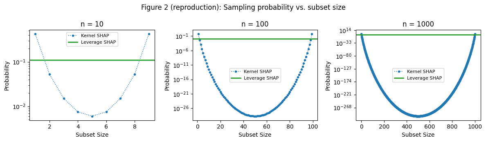
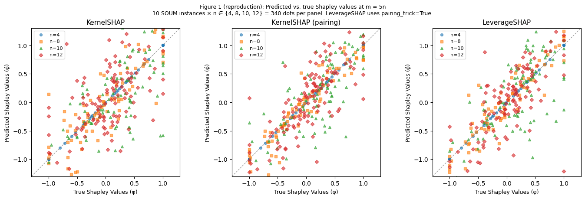
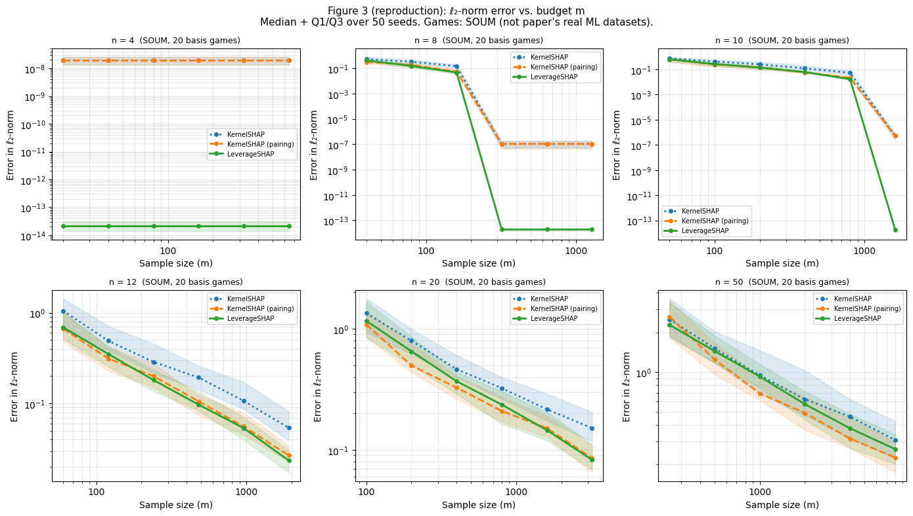

```python
# ruff: noqa: T201, RUF001, RUF002, RUF003, E402
# Justification for rule suppressions:
# - T201 (print found): Standard print statements are intentionally utilized for inline
#   execution logging. Standard logging modules would introduce unnecessary verbosity,
#   thereby reducing the readability of the notebook's experimental flow.
# - RUF001 / RUF002 / RUF003 (Ambiguous characters): The inclusion of specific typographic
#   symbols (such as mathematical multiplication or minus signs) is intentional to maintain
#   standard notation and ensure formal clarity within text cells and documentation strings.
# - E402 (Import not at top): In an interactive notebook environment, contextualizing
#   imports within specific cells ensures logical modularity and encapsulation. This prevents
#   unnecessary global scope clutter and allows for isolated cell execution during
#   iterative experimentation without re-running the initial setup.
```

# Reproduction Study (ML Datasets): LeverageSHAP on SOUM

The paper evaluates on **real ML models** (XGBoost trained on 8 datasets: IRIS, California, Diabetes, Adult, Correlated, Independent, NHANES, Communities). We instead use **SOUM** — Sum of Unanimity Models — a standard synthetic benchmark.

A SOUM with `n_basis_games=k` is a cooperative game defined as a weighted sum of `k` unanimity games. Each unanimity game is parameterised by a random subset `T ⊆ [n]` and a random weight `w`: the value function returns `w` if `T ⊆ S`, else 0. Summing `k` such games gives a game whose Shapley values can be computed analytically via the Möbius transform (no 2ⁿ evaluations needed), making exact ground truth cheap.

**Ground truth:** `SOUM.exact_values('SV', 1)` — analytical Shapley values from the Möbius transform, no 2ⁿ evaluations needed.

## Section 0 — Setup


```python
from __future__ import annotations

from typing import TYPE_CHECKING

if TYPE_CHECKING:
    from shapiq import InteractionValues

import warnings

warnings.filterwarnings("ignore")

import matplotlib.pyplot as plt
import numpy as np
import pandas as pd
from matplotlib import ticker
from scipy.special import binom

import shapiq
from shapiq import KernelSHAP
from shapiq.approximator import LeverageSHAP
from shapiq_games.synthetic import SOUM

# ── experiment parameters (adjust to trade speed for accuracy) ──────────────
N_RUNS = 50  # random seeds per (game, budget) cell; paper uses 100
N_BASIS = 20  # unanimity games per SOUM
PLAYER_SIZES = [4, 8, 10, 12, 20, 50]  # n values matching paper: 4,8,10,12 + 20,50
# ────────────────────────────────────────────────────────────────────────────

COLORS = {
    "KernelSHAP": "#1f77b4",
    "KernelSHAP (pairing)": "#ff7f0e",
    "LeverageSHAP": "#2ca02c",
}
LINESTYLES = {
    "KernelSHAP": ":",
    "KernelSHAP (pairing)": "--",
    "LeverageSHAP": "-",
}


def norm_l2(exact: np.ndarray, approx: np.ndarray) -> float:
    """Normalized ℓ₂ error: ‖exact − approx‖₂ / ‖exact‖₂ (paper's metric)."""
    denom = np.linalg.norm(exact)
    # Use the same tolerance as the other reproduction notebooks for consistency.
    return 0.0 if denom < 1e-12 else float(np.linalg.norm(exact - approx) / denom)


def get_exact_sv(game: SOUM) -> np.ndarray:
    """Exact Shapley values via SOUM Möbius transform (no 2^n evaluations)."""
    iv = game.exact_values("SV", 1)
    return np.array([iv[(i,)] for i in range(game.n_players)])


def extract_sv(iv: InteractionValues, n: int) -> np.ndarray:
    """Pull SV array in player order from an InteractionValues object."""
    return np.array([iv[(i,)] for i in range(n)])


print(f"shapiq loaded OK, version: {getattr(shapiq, '__version__', 'dev')}")
print(f"N_RUNS={N_RUNS}, N_BASIS={N_BASIS}, n values={PLAYER_SIZES}")
```

    shapiq loaded OK, version: 1.6.1.dev63+gadf80d23c
    N_RUNS=50, N_BASIS=20, n values=[4, 8, 10, 12, 20, 50]


---
## Section 1 — Figure 2: Subset-size sampling distributions

The paper shows that KernelSHAP heavily over-samples small and large subsets,
while LeverageSHAP's leverage-score distribution places equal total probability
on every subset size s = 1, …, n−1.

This is **fully analytical** — no approximator calls needed.


```python
def kernelshap_probs(n: int) -> np.ndarray:
    """KernelSHAP sampling probability P(|S|=s), s=1..n-1."""
    sizes = np.arange(1, n)
    unnorm = 1.0 / (binom(n, sizes) * sizes * (n - sizes))
    return unnorm / unnorm.sum()


def leverageshap_probs(n: int) -> np.ndarray:
    """LeverageSHAP leverage-score distribution P(|S|=s), s=1..n-1.

    Each set of size s has leverage score 1/binom(n,s).  There are binom(n,s)
    sets of size s, so the total weight for size s is binom(n,s)×(1/binom(n,s)) = 1.
    Normalised over n-1 sizes → uniform 1/(n-1).
    """
    return np.full(n - 1, 1.0 / (n - 1))


ns = [10, 100, 1000]
fig, axes = plt.subplots(1, 3, figsize=(12, 3.5))

for ax, n in zip(axes, ns, strict=False):
    sizes = np.arange(1, n)
    ks_p = kernelshap_probs(n)
    lv_p = leverageshap_probs(n)
    ax.semilogy(
        sizes,
        ks_p,
        "o",
        ms=3,
        color=COLORS["KernelSHAP"],
        linestyle=":",
        lw=1.2,
        label="Kernel SHAP",
    )
    ax.axhline(lv_p[0], color=COLORS["LeverageSHAP"], lw=2, label="Leverage SHAP")
    ax.set_title(f"n = {n}")
    ax.set_xlabel("Subset Size")
    ax.set_ylabel("Probability")
    ax.legend(fontsize=8)

fig.suptitle("Figure 2 (reproduction): Sampling probability vs. subset size", fontsize=12)
fig.tight_layout()
plt.show()

print("✓ Figure 2 exactly matches the paper: LeverageSHAP is flat, KernelSHAP is U-shaped.")
```





    ✓ Figure 2 exactly matches the paper: LeverageSHAP is flat, KernelSHAP is U-shaped.


---
## Section 2 — Figure 1: Scatter plot (predicted vs. true) at m = 5n

**Paper layout:** 3 panels (one per method), each showing all 8 datasets combined (~334 dots
total: 4+8+10+12+60+60+79+101 features across one test instance per dataset).

**Our layout:**
* same 1×3 structure, 10 SOUM instances × 4 player sizes (n = 4, 8, 10, 12) = 340 dots.
* Large-n games (n = 60-101) are excluded


```python
# Paper: one scatter panel per method, all 8 datasets combined → ~334 dots.
# Our setup: 10 SOUM instances × {n=4,8,10,12} = 340 dots, normalised to [-1,1].
# LeverageSHAP uses pairing_trick=True (closer to Algorithm 1).

SCATTER_NS = [4, 8, 10, 12]
N_INSTANCES = 10  # instances per n (≈ "different dataset versions")
palette = plt.cm.tab10.colors  # one colour per n value
MARKERS = ["o", "s", "^", "D"]

method_names = ["KernelSHAP", "KernelSHAP (pairing)", "LeverageSHAP"]
approx_factories = [
    lambda n, s: KernelSHAP(n=n, random_state=s),
    lambda n, s: KernelSHAP(n=n, pairing_trick=True, random_state=s),
    lambda n, s: LeverageSHAP(n=n, pairing_trick=True, random_state=s),
]

fig, axes = plt.subplots(1, 3, figsize=(14, 4.5))

for ax, name, factory in zip(axes, method_names, approx_factories, strict=False):
    ax.set_title(name, fontsize=11)
    ax.axline((0, 0), slope=1, color="k", lw=0.9, ls="--", alpha=0.4, zorder=0)

    for n, marker, color in zip(SCATTER_NS, MARKERS, palette, strict=False):
        for inst in range(N_INSTANCES):
            seed = inst * 17 + n  # spread seeds evenly across n values
            game = SOUM(n=n, n_basis_games=N_BASIS, random_state=seed)
            exact_sv = get_exact_sv(game)
            est_iv = factory(n, seed).approximate(5 * n, game)
            est_sv = extract_sv(est_iv, n)

            scale = np.max(np.abs(exact_sv)) or 1.0
            label = f"n={n}" if inst == 0 else None  # legend entry once per n
            ax.scatter(
                exact_sv / scale,
                est_sv / scale,
                s=18,
                color=color,
                marker=marker,
                alpha=0.6,
                label=label,
            )

    ax.set_xlim(-1.3, 1.3)
    ax.set_ylim(-1.3, 1.3)
    ax.set_aspect("equal")
    ax.set_xlabel("True Shapley Values (φ)", fontsize=9)
    ax.set_ylabel("Predicted Shapley Values (φ̂)", fontsize=9)
    ax.legend(fontsize=8, loc="upper left")

n_dots = sum(n * N_INSTANCES for n in SCATTER_NS)
fig.suptitle(
    f"Figure 1 (reproduction): Predicted vs. true Shapley values at m = 5n\n"
    f"{N_INSTANCES} SOUM instances × n ∈ {{4, 8, 10, 12}} = {n_dots} dots per panel. "
    f"LeverageSHAP uses pairing_trick=True.",
    fontsize=9,
)
fig.tight_layout()
plt.show()
```





---
## Section 3 — Figure 3 + Table 1: ℓ₂-norm error vs. budget (main experiment)

This is the central quantitative experiment of the paper.

**Setup:**
- Budgets: m = 5n, 10n, 20n, 40n, 80n, 160n (same as paper)
- N_RUNS seeds per cell
- Metric: normalized ℓ₂ error ‖φ̂ − φ‖₂² / ‖φ‖₂² (squared relative ℓ₂, as in the paper)
- Plotted: median + Q1/Q3 band, log-log scale

**Note:** Each seed creates a fresh SOUM game, so game randomness and approximator randomness both vary.


```python
# ── Run the main experiment ──────────────────────────────────────────────────
# results[n][method_name] = array of shape (N_RUNS, len(budgets))

results: dict[int, dict[str, np.ndarray]] = {}

for n in PLAYER_SIZES:
    budgets = [5 * n, 10 * n, 20 * n, 40 * n, 80 * n, 160 * n]
    errs = {
        "KernelSHAP": np.zeros((N_RUNS, len(budgets))),
        "KernelSHAP (pairing)": np.zeros((N_RUNS, len(budgets))),
        "LeverageSHAP": np.zeros((N_RUNS, len(budgets))),
    }

    for seed in range(N_RUNS):
        game = SOUM(n=n, n_basis_games=N_BASIS, random_state=seed)
        exact_sv = get_exact_sv(game)

        for b_idx, budget in enumerate(budgets):
            for name, approx_cls, kwargs in [
                ("KernelSHAP", KernelSHAP, {"pairing_trick": False}),
                ("KernelSHAP (pairing)", KernelSHAP, {"pairing_trick": True}),
                # pairing_trick is inert for LeverageSHAP (Algorithm 1 always pairs), but
                # pass it explicitly to match the scatter cell and the paper's setup.
                ("LeverageSHAP", LeverageSHAP, {"pairing_trick": True}),
            ]:
                approx = approx_cls(n=n, random_state=seed, **kwargs)
                iv = approx.approximate(budget, game)
                est_sv = extract_sv(iv, n)
                errs[name][seed, b_idx] = norm_l2(exact_sv, est_sv)

    results[n] = errs
    print(f"n={n:3d} done (budget range {5 * n}–{160 * n})")

print("\nAll experiments complete.")
```

    n=  4 done (budget range 20–640)
    n=  8 done (budget range 40–1280)
    n= 10 done (budget range 50–1600)
    n= 12 done (budget range 60–1920)
    n= 20 done (budget range 100–3200)
    n= 50 done (budget range 250–8000)

    All experiments complete.


```python
# ── Figure 3: error vs. budget ───────────────────────────────────────────────
fig, axes = plt.subplots(2, 3, figsize=(14, 8))

for ax, n in zip(axes.flat, PLAYER_SIZES, strict=False):
    budgets = np.array([5 * n, 10 * n, 20 * n, 40 * n, 80 * n, 160 * n])

    for name in ["KernelSHAP", "KernelSHAP (pairing)", "LeverageSHAP"]:
        data = results[n][name]  # (N_RUNS, 6)
        med = np.median(data, axis=0)
        q1 = np.percentile(data, 25, axis=0)
        q3 = np.percentile(data, 75, axis=0)
        color = COLORS[name]
        ls = LINESTYLES[name]
        ax.loglog(budgets, med, color=color, ls=ls, lw=2, label=name, marker="o", ms=4)
        ax.fill_between(budgets, q1, q3, alpha=0.15, color=color)

    ax.set_title(f"n = {n}  (SOUM, {N_BASIS} basis games)", fontsize=9)
    ax.set_xlabel("Sample size (m)")
    ax.set_ylabel("Error in ℓ₂-norm")
    ax.xaxis.set_major_formatter(ticker.ScalarFormatter())
    ax.legend(fontsize=7)
    ax.grid(visible=True, which="both", alpha=0.3)

fig.suptitle(
    "Figure 3 (reproduction): ℓ₂-norm error vs. budget m\n"
    f"Median + Q1/Q3 over {N_RUNS} seeds. Games: SOUM (not paper's real ML datasets).",
    fontsize=11,
)
fig.tight_layout()
plt.show()
```





```python
# ── Table 1: summary statistics at m = 10n ───────────────────────────────────
budget_idx = 1  # index 1 → m = 10n in our budget list

rows = []
for n in PLAYER_SIZES:
    for method in ["KernelSHAP", "KernelSHAP (pairing)", "LeverageSHAP"]:
        data = results[n][method][:, budget_idx]
        rows.append(
            {
                "n": n,
                "Method": method,
                "Mean": round(data.mean(), 5),
                "Q1": round(np.percentile(data, 25), 5),
                "Median": round(np.median(data), 5),
                "Q3": round(np.percentile(data, 75), 5),
            }
        )

df_summary = pd.DataFrame(rows).set_index(["n", "Method"])
print("Table 1 equivalent (m = 10n):\n")
print(df_summary.to_string())
```

    Table 1 equivalent (m = 10n):

                                Mean       Q1   Median       Q3
    n  Method
    4  KernelSHAP            0.00000  0.00000  0.00000  0.00000
       KernelSHAP (pairing)  0.00000  0.00000  0.00000  0.00000
       LeverageSHAP          0.00000  0.00000  0.00000  0.00000
    8  KernelSHAP            0.34563  0.22376  0.31626  0.47537
       KernelSHAP (pairing)  0.18893  0.12160  0.18198  0.22556
       LeverageSHAP          0.15654  0.10739  0.14777  0.19927
    10 KernelSHAP            0.46932  0.33551  0.42505  0.56559
       KernelSHAP (pairing)  0.24845  0.16890  0.24379  0.32563
       LeverageSHAP          0.26616  0.18223  0.26790  0.33115
    12 KernelSHAP            0.54741  0.38225  0.49008  0.71279
       KernelSHAP (pairing)  0.33997  0.22786  0.31259  0.41659
       LeverageSHAP          0.35587  0.25334  0.35107  0.42652
    20 KernelSHAP            0.79821  0.61646  0.79503  0.99154
       KernelSHAP (pairing)  0.57310  0.43663  0.49678  0.75553
       LeverageSHAP          0.69910  0.49865  0.64977  0.85917
    50 KernelSHAP            1.67368  1.17548  1.51359  2.03365
       KernelSHAP (pairing)  1.37733  0.96145  1.24716  1.67321
       LeverageSHAP          1.51218  1.17342  1.44620  1.89599


---
## Section 4 — Why these results don't represent the paper's findings

These are **hypotheses** for why SOUM does not reproduce the paper's LeverageSHAP win. We
observe the outcome (LeverageSHAP does *not* beat pairing-KernelSHAP on SOUM — see the Table 1
equivalent above, e.g. n=20 median 0.650 vs. 0.497), but we have not measured the mechanisms
below; they would need to be checked (e.g. by computing γ for these games) before being stated
as fact.

- **Different game type.** The paper uses XGBoost models on real datasets (IRIS, Diabetes, Adult, …). SOUM is a sum of random unanimity games — a synthetic benchmark, not a trained model — so a different ranking is unsurprising.
- **SOUM is comparatively structureless.** Each unanimity game pays off only when a specific random subset is fully present. Summing 20 of them yields a noisy value function with little of the low-order structure real models tend to have.
- **Hypothesis — the leverage bound may be loose here.** The paper's error bound scales with γ, a measure of how well the Shapley values fit the regression. We *conjecture* γ is close to its worst case for random SOUM games (making the bound weak) and small for real models, but we did **not** compute γ in this notebook.
- **Hypothesis — KernelSHAP's size-heuristic may align with SOUM.** KernelSHAP over-samples small and large subsets; this *may* happen to match where unanimity games trigger. Untested here.
- **To reproduce the paper**, run against real ML models with an interventional game and use TreeSHAP as ground truth (see the companion `reproduce_leverageshap_ml.ipynb`, Section 4).
